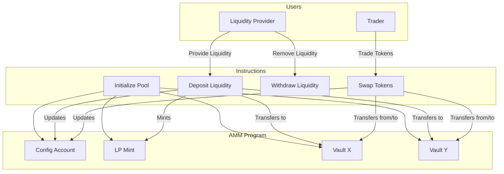
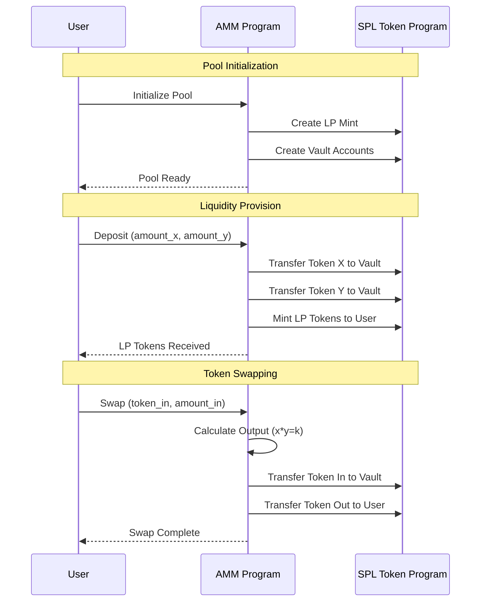
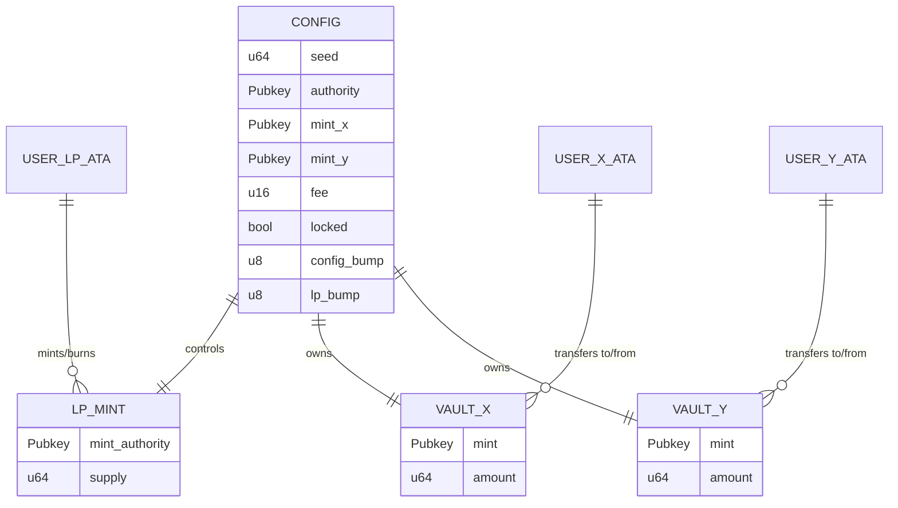

# AMM dengan Solana Anchor

## 🎯 Tentang Project AMM

**Automated Market Maker (AMM)** adalah smart contract yang memungkinkan pertukaran token secara otomatis menggunakan formula matematika, tanpa memerlukan order book tradisional.

**Key Concepts:**

- **Constant Product Formula**: x \* y = k
- **Liquidity Pool**: Kumpulan dua token yang dipasangkan
- **LP Tokens**: Token yang diberikan kepada liquidity providers
- **Slippage**: Perubahan harga karena ukuran transaksi

---

## 🏗️ System Architecture

### High-Level System Overview



**📝 Penjelasan:**

- **Users**: Dua tipe pengguna utama - Liquidity Provider (menyediakan token) dan Trader (menukar token)
- **AMM Program**: Terdiri dari 4 account utama yang menyimpan state dan token pool
- **Instructions**: 4 operasi inti yang dapat dilakukan users untuk berinteraksi dengan pool
- **Flow**: Setiap instruction berinteraksi dengan account-account yang relevan untuk melakukan operasinya

### User Interaction Flow



**📝 Penjelasan:**

- **Pool Initialization**: User memanggil initialize, AMM Program membuat LP mint dan vault accounts via SPL Token Program
- **Liquidity Provision**: User deposit token X & Y, AMM transfer tokens ke vault dan mint LP tokens sebagai bukti kepemilikan
- **Token Swapping**: User swap token, AMM hitung output dengan formula x\*y=k, lalu execute transfer melalui SPL Program
- **Cross-Program Calls**: AMM Program berinteraksi dengan SPL Token Program untuk semua operasi token

### Account Relationships



**📝 Penjelasan:**

- **CONFIG**: Account utama yang menyimpan konfigurasi pool dan controls LP_MINT serta owns kedua vault
- **VAULT_X & VAULT_Y**: Token accounts yang menyimpan actual tokens (X dan Y) yang di-pool oleh users
- **LP_MINT**: Mint account untuk LP tokens yang di-mint kepada liquidity providers sebagai proof of ownership
- **USER ATAs**: Associated Token Accounts milik users untuk berinteraksi dengan vaults dan LP mint
- **Relationships**: One-to-one controls/ownership, many-to-many user interactions

---

## 📚 Learning Path

### 📍 Phase 1: Foundation Setup

**File Detail**: [`learning-01-foundation.md`](./docs/learning-01-foundation.md)

- Setup Anchor project dengan proper dependencies
- Membuat constants dan PDA seeds untuk AMM
- Implementasi comprehensive error handling
- Design state structures untuk pool management
- Testing environment setup

### 📍 Phase 2: Pool Initialization

**File Detail**: [`learning-02-initialize.md`](./docs/learning-02-initialize.md)

- Membuat PDA (Program Derived Address) untuk config account
- Setup LP mint dengan proper authority management
- Initialize vault accounts untuk token storage
- Implement validation logic dan access control
- Cross-program invocation dengan SPL Token Program
- Testing pool initialization flow

### 📍 Phase 3a: Deposit Liquidity

**File Detail**: [`learning-03a-deposit.md`](./docs/learning-03a-deposit.md)

- Implementasi deposit liquidity dengan detailed context & validation
- Perhitungan LP token untuk first deposit vs subsequent deposits
- Integrasi CPI untuk transfer token dan mint LP
- Proteksi slippage dan mathematical safety

### 📍 Phase 3b: Withdraw Liquidity

**File Detail**: [`learning-03b-withdraw.md`](./docs/learning-03b-withdraw.md)

- Implementasi withdraw liquidity dengan context & validation
- Perhitungan proportional withdrawal berdasarkan LP share
- Integrasi CPI untuk burn LP dan transfer token dari vault
- Proteksi slippage

### 📍 Phase 4: Token Swapping

**File Detail**: [`learning-04-swap.md`](./docs/learning-04-swap.md)

- Implementasi constant product formula (x × y = k) untuk swap
- Perhitungan jumlah output dengan fee (basis points)
- Slippage protection menggunakan minimum output
- Validasi input, akses, dan keamanan dasar
- Cross-program invocations (CPI) untuk transfer token
- Penulisan test end-to-end untuk operasi swap

---

## 📚 Daftar Pustaka & Referensi Teori

### 🔬 AMM Theory & Mathematics

**Constant Product Formula (x \* y = k)**

- **Konsep**: Formula fundamental untuk AMM yang menjaga konstan product dari dua token reserves
- **Aplikasi**: Menentukan harga swap berdasarkan ratio token dalam pool
- **Referensi**: [Uniswap V2 Whitepaper](https://uniswap.org/whitepaper.pdf)
- **Formula Detail**:
  ```
  x * y = k (sebelum dan sesudah swap)
  Price = dy/dx = x/y
  ```

**Slippage & Price Impact**

- **Definisi**: Perubahan harga karena ukuran trade yang mempengaruhi pool balance
- **Rumus**: `Price Impact = (Amount Out Expected - Amount Out Actual) / Amount Out Expected`
- **Mitigasi**: Slippage tolerance dan minimum output amount
- **Referensi**: [Slippage in AMMs](https://docs.uniswap.org/concepts/protocol/swaps#slippage)

**Impermanent Loss**

- **Konsep**: Kerugian temporer liquidity providers karena perubahan harga relatif token
- **Perhitungan**: Perbandingan holding vs providing liquidity
- **Referensi**: [Impermanent Loss Explained](https://academy.binance.com/en/articles/impermanent-loss-explained)

### 🏗️ Solana & Anchor Architecture

**Program Derived Addresses (PDA)**

- **Konsep**: Deterministik address generation tanpa private key
- **Kegunaan**: Account ownership oleh program, bukan user
- **Pattern**: `find_program_address([seeds], program_id)`
- **Referensi**: [Solana PDA Guide](https://solana.com/id/docs/core/pda)

**Cross-Program Invocation (CPI)**

- **Definisi**: Program memanggil instruction dari program lain
- **Implementasi**: `invoke()` dan `invoke_signed()` untuk PDA
- **Use Case**: AMM program memanggil SPL Token program
- **Referensi**: [Solana CPI Guide](https://solana.com/id/docs/core/cpi)

**Account Model & Rent**

- **Rent-Exempt**: Account harus maintain minimum balance
- **Account Size**: Pengaruh terhadap storage cost
- **Optimization**: Minimize account size untuk efisiensi
- **Referensi**: [Solana Account Model](https://solana.com/id/docs/core/accounts)

### 🔐 Security & Best Practices

**Integer Overflow/Underflow**

- **Risiko**: Operasi matematika yang melampaui batas data type
- **Mitigasi**: Checked arithmetic operations
- **Implementation**: `checked_add()`, `checked_mul()` dalam Rust
- **Referensi**: [Solana Security Best Practices](https://github.com/coral-xyz/sealevel-attacks)

**Reentrancy Protection**

- **Konsep**: Mencegah recursive calls yang berbahaya
- **Pattern**: State checks before external calls
- **Implementation**: Lock mechanisms dan proper state management

**Access Control**

- **Authority Patterns**: Optional authority, multi-sig, timelock
- **Validation**: Proper signer verification
- **Implementation**: `require!()` macros untuk kondisi checks

### 📖 Learning Resources

**Official Documentation**

- [Anchor Book](https://www.anchor-lang.com/docs) - Framework documentation
- [Solana Docs](https://solana.com/id/docs) - Platform documentation
- [SPL Token Guide](https://www.solana-program.com/docs/token) - Token program reference

**AMM Implementations**

- [Raydium](https://github.com/raydium-io/raydium-contract) - Popular Solana AMM
- [Orca](https://github.com/orca-so/whirlpool) - Concentrated liquidity AMM
- [Uniswap V2](https://github.com/Uniswap/v2-core) - Original AMM reference

**Mathematics & DeFi Theory**

- [DeFi MOOC](https://defi-learning.org/) - Comprehensive DeFi course
- [Paradigm Research](https://www.paradigm.xyz/writing) - Advanced DeFi concepts
- [AMM Evolution](https://research.paradigm.xyz/amm-price-impact) - Price impact research

### 🛠️ Development Tools

**Testing & Debugging**

- [Solana Test Validator](https://docs.anza.xyz/cli/examples/test-validator) - Local development
- [Anchor Test Framework](https://www.anchor-lang.com/docs/testing) - Unit testing
- [Solana Explorer](https://explorer.solana.com/) - Transaction inspection

**Mathematical Libraries**

- `constant-product-curve` - AMM mathematical operations
- `uint` - Large integer operations
- `decimal` - Precise decimal calculations

---

_Happy Learning! 🚀_
