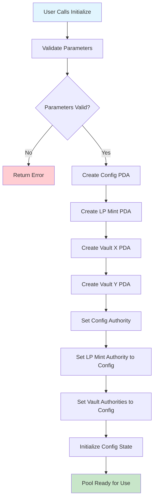
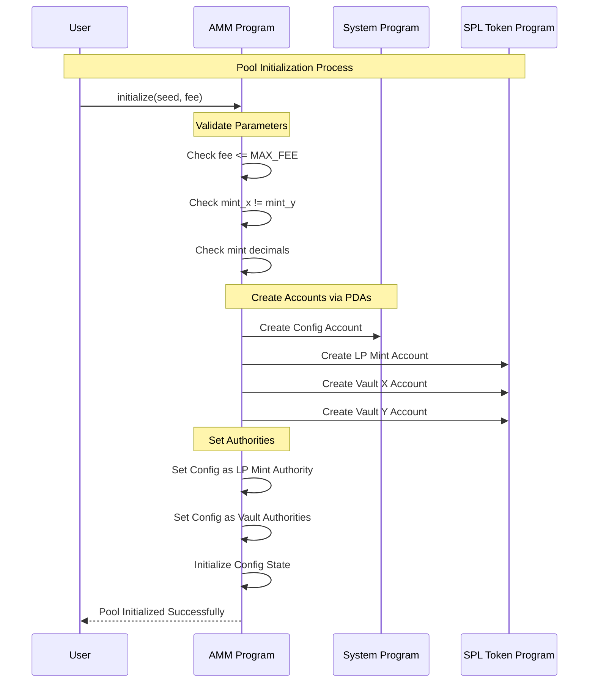

# Phase 2: Pool Initialization

## 🎯 What You'll Learn

Dalam tutorial ini, Anda akan belajar:

- Membuat PDA (Program Derived Address) untuk config account
- Setup LP mint dengan proper authority management
- Initialize vault accounts untuk token storage
- Implement validation logic dan access control
- Cross-program invocation dengan SPL Token Program
- Testing pool initialization flow

---

## Step 1: Initialize Instruction Context

### 🔧 Implementasi Initialize Context

Mari kita buat instruction context untuk pool initialization.

**Step 1.1: Create Initialize Context**

Edit file `programs/amm/src/instructions/initialize.rs`:

```rust
use crate::{constants::*, error::AmmError, state::Config};
use anchor_lang::prelude::*;
use anchor_spl::{
    associated_token::AssociatedToken,
    token::{Mint, Token, TokenAccount},
};

#[derive(Accounts)]
#[instruction(seed: u64, fee: u16)]
pub struct Initialize<'info> {
    /// Authority that can initialize the pool
    #[account(mut)]
    pub authority: Signer<'info>,

    /// The AMM config account to be created
    #[account(
        init,
        payer = authority,
        space = 8 + Config::INIT_SPACE,
        seeds = [CONFIG_SEED.as_bytes(), seed.to_le_bytes().as_ref()],
        bump
    )]
    pub config: Account<'info, Config>,

    /// First token mint for the pool
    pub mint_x: Account<'info, Mint>,

    /// Second token mint for the pool
    pub mint_y: Account<'info, Mint>,

    /// LP token mint to be created
    #[account(
        init,
        payer = authority,
        mint::decimals = 6,
        mint::authority = config,
        seeds = [LP_MINT_SEED.as_bytes(), seed.to_le_bytes().as_ref()],
        bump
    )]
    pub lp_mint: Account<'info, Mint>,

    /// Vault for storing token X
    #[account(
        init,
        payer = authority,
        token::mint = mint_x,
        token::authority = config,
        seeds = [VAULT_X_SEED.as_bytes(), seed.to_le_bytes().as_ref()],
        bump
    )]
    pub vault_x: Account<'info, TokenAccount>,

    /// Vault for storing token Y
    #[account(
        init,
        payer = authority,
        token::mint = mint_y,
        token::authority = config,
        seeds = [VAULT_Y_SEED.as_bytes(), seed.to_le_bytes().as_ref()],
        bump
    )]
    pub vault_y: Account<'info, TokenAccount>,

    /// SPL Token program
    pub token_program: Program<'info, Token>,

    /// Associated Token program
    pub associated_token_program: Program<'info, AssociatedToken>,

    /// System program
    pub system_program: Program<'info, System>,
}

impl<'info> Initialize<'info> {
    /// Validate the initialize parameters
    pub fn validate(&self, fee: u16) -> Result<()> {
        // Validate fee is within acceptable range
        require!(fee <= MAX_FEE_BASIS_POINTS, AmmError::InvalidFee);

        // Ensure mint X and Y are different
        require!(self.mint_x.key() != self.mint_y.key(), AmmError::InvalidToken);

        // Validate mint decimals (optional - for consistency)
        require!(self.mint_x.decimals <= 9, AmmError::InvalidPrecision);
        require!(self.mint_y.decimals <= 9, AmmError::InvalidPrecision);

        Ok(())
    }
}
```

**Penjelasan Key Components:**

- **#[instruction(seed: u64, fee: u16)]**: Parameter yang diterima instruction
- **PDA Derivation**: Semua account menggunakan seed yang sama untuk consistency
- **Authority Management**: Config account menjadi authority untuk LP mint dan vaults
- **Space Allocation**: `Config::INIT_SPACE` untuk automatic space calculation
- **Validation**: Input validation untuk security dan consistency

---

## Step 2: Initialize Implementation Logic

### 🔧 Implementasi Initialize Handler

**Step 2.1: Create Initialize Handler**

Tambahkan handler function di `programs/amm/src/instructions/initialize.rs`:

```rust
pub fn initialize_handler(ctx: Context<Initialize>, seed: u64, fee: u16) -> Result<()> {
    // Validate inputs
    ctx.accounts.validate(fee)?;

    // Get PDA bumps
    let config_bump = ctx.bumps.config;
    let lp_bump = ctx.bumps.lp_mint;

    // Initialize config account
    let config = &mut ctx.accounts.config;
    config.seed = seed;
    config.authority = Some(ctx.accounts.authority.key());
    config.mint_x = ctx.accounts.mint_x.key();
    config.mint_y = ctx.accounts.mint_y.key();
    config.fee = fee;
    config.locked = false; // Pool starts unlocked
    config.config_bump = config_bump;
    config.lp_bump = lp_bump;

    msg!("Pool initialized successfully!");
    msg!("Seed: {}", seed);
    msg!("Authority: {}", ctx.accounts.authority.key());
    msg!("Mint X: {}", ctx.accounts.mint_x.key());
    msg!("Mint Y: {}", ctx.accounts.mint_y.key());
    msg!("Fee: {} basis points", fee);
    msg!("LP Mint: {}", ctx.accounts.lp_mint.key());
    msg!("Vault X: {}", ctx.accounts.vault_x.key());
    msg!("Vault Y: {}", ctx.accounts.vault_y.key());

    Ok(())
}
```

**Penjelasan Implementation:**

- **Input Validation**: Memastikan semua parameter valid sebelum initialization
- **Bump Storage**: Menyimpan PDA bumps untuk efficient future access
- **State Initialization**: Set semua field config dengan nilai yang proper
- **Logging**: Comprehensive logging untuk debugging dan transparency

---

## Step 3: Integration dengan Main Program

### 🔧 Update Main Program File

**Step 3.1: Update lib.rs**

Edit file `programs/amm/src/lib.rs`:

```rust
use anchor_lang::prelude::*;

pub mod constants;
pub mod error;
pub mod instructions;
pub mod state;

use instructions::*;

declare_id!("GcVc8WR7EiPBuDiHGWFCRB8Tpjcqr7d4Jur3uLs1Fs1u");

#[program]
pub mod amm {
    use super::*;

    /// Initialize a new AMM pool
    pub fn initialize(ctx: Context<Initialize>, seed: u64, fee: u16) -> Result<()> {
        instructions::initialize::initialize_handler(ctx, seed, fee)
    }
}
```

**Step 3.2: Update Instructions Module**

Edit file `programs/amm/src/instructions/mod.rs`:

```rust
pub mod deposit;
pub mod initialize;
pub mod swap;

pub use deposit::*;
pub use initialize::*;
pub use swap::*;
```

---

## Step 5: Pool Initialization Flow

### 🔧 Visual Flow Understanding

Mari kita buat diagram untuk memahami pool initialization flow:



**Step 5.1: Account Creation Flow**



---

## Step 6: Testing Pool Initialization

### 🔧 Create Test File

**Step 6.1: Basic Test Implementation**

Buat file `tests/initialize.ts`:

```typescript
import * as anchor from "@coral-xyz/anchor";
import { Program } from "@coral-xyz/anchor";
import { PublicKey, Keypair, SystemProgram } from "@solana/web3.js";
import {
  TOKEN_PROGRAM_ID,
  ASSOCIATED_TOKEN_PROGRAM_ID,
  createMint,
} from "@solana/spl-token";
import { Amm } from "../target/types/amm";
import { expect } from "chai";

describe("AMM Pool Initialization", () => {
  const provider = anchor.AnchorProvider.env();
  anchor.setProvider(provider);
  const program = anchor.workspace.Amm as Program<Amm>;

  let mintX: PublicKey;
  let mintY: PublicKey;
  let authority: Keypair;

  beforeEach(async () => {
    authority = Keypair.generate();

    // Airdrop SOL to authority
    await provider.connection.confirmTransaction(
      await provider.connection.requestAirdrop(authority.publicKey, 2000000000)
    );

    // Create test token mints
    mintX = await createMint(
      provider.connection,
      authority,
      authority.publicKey,
      null,
      6
    );

    mintY = await createMint(
      provider.connection,
      authority,
      authority.publicKey,
      null,
      6
    );
  });

  it("Successfully initializes a new pool", async () => {
    const seed = new anchor.BN(12345);
    const fee = 300; // 3% fee

    // Derive PDA addresses
    const [configPda] = PublicKey.findProgramAddressSync(
      [Buffer.from("config"), seed.toArrayLike(Buffer, "le", 8)],
      program.programId
    );

    const [lpMintPda] = PublicKey.findProgramAddressSync(
      [Buffer.from("lp_mint"), seed.toArrayLike(Buffer, "le", 8)],
      program.programId
    );

    const [vaultXPda] = PublicKey.findProgramAddressSync(
      [Buffer.from("vault_x"), seed.toArrayLike(Buffer, "le", 8)],
      program.programId
    );

    const [vaultYPda] = PublicKey.findProgramAddressSync(
      [Buffer.from("vault_y"), seed.toArrayLike(Buffer, "le", 8)],
      program.programId
    );

    // Initialize the pool
    const tx = await program.methods
      .initialize(seed, fee)
      .accounts({
        authority: authority.publicKey,
        config: configPda,
        mintX: mintX,
        mintY: mintY,
        lpMint: lpMintPda,
        vaultX: vaultXPda,
        vaultY: vaultYPda,
        tokenProgram: TOKEN_PROGRAM_ID,
        associatedTokenProgram: ASSOCIATED_TOKEN_PROGRAM_ID,
        systemProgram: SystemProgram.programId,
      })
      .signers([authority])
      .rpc();

    console.log("Initialize transaction signature:", tx);

    // Verify config account was created correctly
    const configAccount = await program.account.config.fetch(configPda);
    expect(configAccount.seed.toString()).to.equal(seed.toString());
    expect(configAccount.fee).to.equal(fee);
    expect(configAccount.mintX.toString()).to.equal(mintX.toString());
    expect(configAccount.mintY.toString()).to.equal(mintY.toString());
    expect(configAccount.locked).to.be.false;
  });

  it("Fails with invalid fee", async () => {
    const seed = new anchor.BN(12346);
    const fee = 10000; // 100% fee - should fail

    const [configPda] = PublicKey.findProgramAddressSync(
      [Buffer.from("config"), seed.toArrayLike(Buffer, "le", 8)],
      program.programId
    );

    try {
      await program.methods
        .initialize(seed, fee)
        .accounts({
          authority: authority.publicKey,
          config: configPda,
          // ... other accounts
        })
        .signers([authority])
        .rpc();

      expect.fail("Should have failed with invalid fee");
    } catch (error) {
      expect(error.message).to.include("InvalidFee");
    }
  });

  it("Fails when mint X equals mint Y", async () => {
    const seed = new anchor.BN(12347);
    const fee = 300;

    const [configPda] = PublicKey.findProgramAddressSync(
      [Buffer.from("config"), seed.toArrayLike(Buffer, "le", 8)],
      program.programId
    );

    try {
      await program.methods
        .initialize(seed, fee)
        .accounts({
          authority: authority.publicKey,
          config: configPda,
          mintX: mintX,
          mintY: mintX, // Same mint - should fail
          // ... other accounts
        })
        .signers([authority])
        .rpc();

      expect.fail("Should have failed with same mints");
    } catch (error) {
      expect(error.message).to.include("InvalidToken");
    }
  });
});
```

---

## 🎯 Tutorial Complete!

Congratulations! Anda telah menyelesaikan Phase 2 pool initialization. Sekarang Anda memiliki:

✅ **Pool Initialization System:**

- Complete PDA derivation untuk semua accounts
- Proper authority management dengan config as central authority
- Comprehensive validation logic
- Cross-program invocation setup
- Testing framework untuk verification

---

## 🚀 Next Steps

**Phase 3**: Liquidity Management

- Implement deposit liquidity instruction
- Calculate LP token amounts dengan mathematical formulas
- Handle first deposit vs subsequent deposits
- Implement withdraw liquidity dengan proper burns

**Testing Your Initialization:**

```bash
# Build the program
anchor build

# Run initialization tests
anchor test --skip-local-validator

# Start local validator untuk manual testing
solana-test-validator
```

---

## 📚 Daftar Pustaka & Referensi

### 🏗️ Program Derived Addresses (PDA)

**PDA Fundamentals**

- **Konsep**: Deterministik address generation yang dikontrol oleh program
- **Kegunaan**: Account ownership tanpa private key, security melalui program control
- **Pattern**: `find_program_address([seeds], program_id)` untuk address derivation
- **Referensi**: [Solana PDA Documentation](https://solana.com/id/docs/core/pda)

**PDA Best Practices**

- **Seed Selection**: Gunakan meaningful constants untuk predictable addresses
- **Bump Storage**: Simpan bumps untuk efficient future access
- **Authority Pattern**: Central authority account mengontrol semua child accounts
- **Referensi**: [Anchor PDA Guide](https://www.anchor-lang.com/docs/pdas)

### 🔗 Cross-Program Invocation (CPI)

**CPI Fundamentals**

- **Definisi**: Mechanism untuk program memanggil instruction dari program lain
- **Implementation**: `invoke()` untuk regular calls, `invoke_signed()` untuk PDA calls
- **Use Cases**: AMM program memanggil SPL Token program untuk token operations
- **Referensi**: [Solana CPI Guide](https://solana.com/id/docs/core/cpi)

**CPI Security Considerations**

- **Signer Verification**: Pastikan PDA signatures valid untuk account operations
- **Program Verification**: Verify target program IDs untuk prevent malicious calls
- **Authority Management**: Proper authority setup untuk secure account control
- **Referensi**: [CPI Security Best Practices](https://github.com/coral-xyz/sealevel-attacks)

### 🏦 SPL Token Program Integration

**Token Account Creation**

- **Associated Token Accounts**: Standard pattern untuk user token accounts
- **Mint Authority**: Program-controlled mint untuk LP tokens
- **Token Account Authority**: Vault accounts dikontrol oleh config PDA
- **Referensi**: [SPL Token Documentation](https://spl.solana.com/token)

**Authority Management Patterns**

- **Mint Authority**: Config account sebagai mint authority untuk LP tokens
- **Transfer Authority**: Config account mengontrol vault token accounts
- **Freeze Authority**: Optional freeze functionality untuk emergency situations
- **Referensi**: [Token Authority Guide](https://docs.solana.com/developing/programming-model/calling-between-programs#program-signed-accounts)

### 🔧 Anchor Framework Patterns

**Account Constraints**

- **#[account(init)]**: Automatic account initialization dengan space calculation
- **#[account(seeds, bump)]**: PDA derivation dengan automatic bump validation
- **#[account(mut)]**: Mutable account access untuk state modifications
- **Referensi**: [Anchor Account Constraints](https://www.anchor-lang.com/docs/account-constraints)

**Space Calculation**

- **#[derive(InitSpace)]**: Automatic space calculation untuk account initialization
- **Manual Space**: Custom space calculation untuk complex structures
- **Rent Exemption**: Minimum balance requirements untuk account persistence
- **Referensi**: [Anchor Space Management](https://www.anchor-lang.com/docs/space)

### 🧪 Testing Strategies

**Unit Testing Patterns**

- **Setup/Teardown**: Proper test environment initialization
- **Account Verification**: Validate account states after operations
- **Error Testing**: Verify error conditions dan failure scenarios
- **Referensi**: [Anchor Testing Guide](https://www.anchor-lang.com/docs/testing)

**Integration Testing**

- **Multi-Instruction Flows**: Test complete user journeys
- **Cross-Program Testing**: Verify CPI interactions
- **State Persistence**: Validate state changes across transactions
- **Referensi**: [Solana Test Validator](https://docs.anza.xyz/cli/examples/test-validator)

### 📖 AMM Architecture References

**Pool Initialization Patterns**

- **Factory Pattern**: Standardized pool creation dengan consistent addresses
- **Configuration Management**: Centralized config untuk pool parameters
- **Authority Models**: Various authority patterns untuk different use cases
- **Referensi**: [Uniswap V2 Factory](https://github.com/Uniswap/v2-core/blob/master/contracts/UniswapV2Factory.sol)

**Solana AMM Implementations**

- [Raydium AMM](https://github.com/raydium-io/raydium-contract) - Production Solana AMM
- [Orca AMM](https://github.com/orca-so/whirlpool) - Concentrated liquidity model
- [Serum AMM](https://github.com/project-serum/serum-dex) - Order book integration

---

_Next: [Phase 3 - Liquidity Management](./learning-03a-deposit.md)_ 🚀
