# Phase 3: Liquidity Management

## 🎯 What You'll Learn

Dalam tutorial ini, Anda akan belajar:

- Implementasi deposit liquidity dengan mathematical calculations
- Calculate LP token amounts menggunakan constant product formula
- Handle first deposit vs subsequent deposits dengan different logic
- Implement withdraw liquidity dengan proportional token distribution
- Cross-program invocations untuk token transfers dan burns
- Testing liquidity management flow dengan comprehensive scenarios

---

## Step 1: Deposit Liquidity Context

### 🔧 Implementasi Deposit Context

Mari kita buat instruction context untuk liquidity deposit.

**Step 1.1: Create Deposit Context**

Edit file `programs/amm/src/instructions/deposit.rs`:

```rust
use crate::{constants::*, error::AmmError, state::Config};
use anchor_lang::prelude::*;
use anchor_spl::{
    associated_token::AssociatedToken,
    token::{self, Mint, Token, TokenAccount, Transfer, MintTo},
};

#[derive(Accounts)]
pub struct Deposit<'info> {
    /// User depositing liquidity
    #[account(mut)]
    pub user: Signer<'info>,

    /// AMM config account
    #[account(
        seeds = [CONFIG_SEED.as_bytes(), config.seed.to_le_bytes().as_ref()],
        bump = config.config_bump,
        constraint = !config.locked @ AmmError::PoolLocked
    )]
    pub config: Account<'info, Config>,

    /// First token mint
    #[account(constraint = mint_x.key() == config.mint_x @ AmmError::InvalidToken)]
    pub mint_x: Account<'info, Mint>,

    /// Second token mint
    #[account(constraint = mint_y.key() == config.mint_y @ AmmError::InvalidToken)]
    pub mint_y: Account<'info, Mint>,

    /// LP token mint
    #[account(
        mut,
        seeds = [LP_MINT_SEED.as_bytes(), config.seed.to_le_bytes().as_ref()],
        bump = config.lp_bump
    )]
    pub lp_mint: Account<'info, Mint>,

    /// User's token X account
    #[account(
        mut,
        associated_token::mint = mint_x,
        associated_token::authority = user
    )]
    pub user_x: Account<'info, TokenAccount>,

    /// User's token Y account
    #[account(
        mut,
        associated_token::mint = mint_y,
        associated_token::authority = user
    )]
    pub user_y: Account<'info, TokenAccount>,

    /// User's LP token account
    #[account(
        init_if_needed,
        payer = user,
        associated_token::mint = lp_mint,
        associated_token::authority = user
    )]
    pub user_lp: Account<'info, TokenAccount>,

    /// Vault for token X
    #[account(
        mut,
        seeds = [VAULT_X_SEED.as_bytes(), config.seed.to_le_bytes().as_ref()],
        bump,
        token::mint = mint_x,
        token::authority = config
    )]
    pub vault_x: Account<'info, TokenAccount>,

    /// Vault for token Y
    #[account(
        mut,
        seeds = [VAULT_Y_SEED.as_bytes(), config.seed.to_le_bytes().as_ref()],
        bump,
        token::mint = mint_y,
        token::authority = config
    )]
    pub vault_y: Account<'info, TokenAccount>,

    /// SPL Token program
    pub token_program: Program<'info, Token>,

    /// Associated Token program
    pub associated_token_program: Program<'info, AssociatedToken>,

    /// System program
    pub system_program: Program<'info, System>,
}

impl<'info> Deposit<'info> {
    /// Validate deposit parameters
    pub fn validate(&self, amount_x: u64, amount_y: u64, min_lp: u64) -> Result<()> {
        // Check amounts are positive
        require!(amount_x > 0 && amount_y > 0, AmmError::InvalidAmount);
        require!(min_lp > 0, AmmError::LiquidityLessThanMinimum);

        // Check user has sufficient balance
        require!(self.user_x.amount >= amount_x, AmmError::InsufficientBalance);
        require!(self.user_y.amount >= amount_y, AmmError::InsufficientBalance);

        Ok(())
    }

    /// Check if this is the first deposit (empty pool)
    pub fn is_first_deposit(&self) -> bool {
        self.vault_x.amount == 0 && self.vault_y.amount == 0
    }

    /// Calculate LP tokens for first deposit
    pub fn calculate_first_deposit_lp(&self, amount_x: u64, amount_y: u64) -> Result<u64> {
        // For first deposit, LP = sqrt(x * y) - MINIMUM_LIQUIDITY
        let product = (amount_x as u128)
            .checked_mul(amount_y as u128)
            .ok_or(AmmError::Overflow)?;

        let lp_amount = (product as f64).sqrt() as u64;

        require!(lp_amount > MINIMUM_LIQUIDITY, AmmError::LiquidityLessThanMinimum);

        Ok(lp_amount.checked_sub(MINIMUM_LIQUIDITY).ok_or(AmmError::Underflow)?)
    }

    /// Calculate LP tokens for subsequent deposits
    pub fn calculate_subsequent_deposit_lp(
        &self,
        amount_x: u64,
        amount_y: u64,
    ) -> Result<u64> {
        let reserve_x = self.vault_x.amount;
        let reserve_y = self.vault_y.amount;
        let total_supply = self.lp_mint.supply;

        require!(reserve_x > 0 && reserve_y > 0, AmmError::ZeroBalance);
        require!(total_supply > 0, AmmError::ZeroBalance);

        // Calculate LP based on the minimum ratio to maintain pool balance
        let lp_from_x = (amount_x as u128)
            .checked_mul(total_supply as u128)
            .ok_or(AmmError::Overflow)?
            .checked_div(reserve_x as u128)
            .ok_or(AmmError::ZeroBalance)?;

        let lp_from_y = (amount_y as u128)
            .checked_mul(total_supply as u128)
            .ok_or(AmmError::Overflow)?
            .checked_div(reserve_y as u128)
            .ok_or(AmmError::ZeroBalance)?;

        // Take the minimum to maintain pool ratio
        let lp_amount = std::cmp::min(lp_from_x, lp_from_y) as u64;

        require!(lp_amount > 0, AmmError::LiquidityLessThanMinimum);

        Ok(lp_amount)
    }

    /// Transfer tokens from user to vaults
    pub fn transfer_to_vaults(&self, amount_x: u64, amount_y: u64) -> Result<()> {
        // Transfer token X to vault
        let transfer_x_ctx = CpiContext::new(
            self.token_program.to_account_info(),
            Transfer {
                from: self.user_x.to_account_info(),
                to: self.vault_x.to_account_info(),
                authority: self.user.to_account_info(),
            },
        );
        token::transfer(transfer_x_ctx, amount_x)?;

        // Transfer token Y to vault
        let transfer_y_ctx = CpiContext::new(
            self.token_program.to_account_info(),
            Transfer {
                from: self.user_y.to_account_info(),
                to: self.vault_y.to_account_info(),
                authority: self.user.to_account_info(),
            },
        );
        token::transfer(transfer_y_ctx, amount_y)?;

        Ok(())
    }

    /// Mint LP tokens to user
    pub fn mint_lp_tokens(&self, lp_amount: u64, config_bump: u8) -> Result<()> {
        let seeds = &[
            CONFIG_SEED.as_bytes(),
            &self.config.seed.to_le_bytes(),
            &[config_bump],
        ];
        let signer_seeds = &[&seeds[..]];

        let mint_ctx = CpiContext::new_with_signer(
            self.token_program.to_account_info(),
            MintTo {
                mint: self.lp_mint.to_account_info(),
                to: self.user_lp.to_account_info(),
                authority: self.config.to_account_info(),
            },
            signer_seeds,
        );

        token::mint_to(mint_ctx, lp_amount)?;

        Ok(())
    }
}
```

**Penjelasan Key Components:**

- **Validation Logic**: Comprehensive checks untuk amounts, balances, dan pool state
- **First vs Subsequent**: Different calculation logic untuk first deposit
- **Mathematical Safety**: Checked arithmetic untuk prevent overflow/underflow
- **CPI Integration**: Cross-program calls untuk token transfers dan minting
- **Authority Management**: Proper signer seeds untuk PDA operations

---

## Step 2: Deposit Implementation Logic

### 🔧 Implementasi Deposit Handler

**Step 2.1: Create Deposit Handler**

Tambahkan handler function di `programs/amm/src/instructions/deposit.rs`:

```rust
pub fn deposit_handler(
    ctx: Context<Deposit>,
    amount_x: u64,
    amount_y: u64,
    min_lp: u64,
) -> Result<()> {
    // Validate inputs
    ctx.accounts.validate(amount_x, amount_y, min_lp)?;

    let config_bump = ctx.accounts.config.config_bump;

    // Calculate LP tokens based on deposit type
    let lp_amount = if ctx.accounts.is_first_deposit() {
        msg!("First deposit detected");
        ctx.accounts.calculate_first_deposit_lp(amount_x, amount_y)?
    } else {
        msg!("Subsequent deposit detected");
        ctx.accounts.calculate_subsequent_deposit_lp(amount_x, amount_y)?
    };

    // Check slippage protection
    require!(lp_amount >= min_lp, AmmError::SlippageExceeded);

    // Transfer tokens to vaults
    ctx.accounts.transfer_to_vaults(amount_x, amount_y)?;

    // Mint LP tokens to user
    ctx.accounts.mint_lp_tokens(lp_amount, config_bump)?;

    msg!("Liquidity deposited successfully!");
    msg!("Amount X: {}", amount_x);
    msg!("Amount Y: {}", amount_y);
    msg!("LP Tokens Minted: {}", lp_amount);
    msg!("Vault X Balance: {}", ctx.accounts.vault_x.amount + amount_x);
    msg!("Vault Y Balance: {}", ctx.accounts.vault_y.amount + amount_y);

    Ok(())
}
```

---

## Step 3: Withdraw Liquidity Context

### 🔧 Implementasi Withdraw Context

**Step 3.1: Create Withdraw Context**

Tambahkan di file `programs/amm/src/instructions/deposit.rs`:

```rust
#[derive(Accounts)]
pub struct Withdraw<'info> {
    /// User withdrawing liquidity
    #[account(mut)]
    pub user: Signer<'info>,

    /// AMM config account
    #[account(
        seeds = [CONFIG_SEED.as_bytes(), config.seed.to_le_bytes().as_ref()],
        bump = config.config_bump,
        constraint = !config.locked @ AmmError::PoolLocked
    )]
    pub config: Account<'info, Config>,

    /// First token mint
    #[account(constraint = mint_x.key() == config.mint_x @ AmmError::InvalidToken)]
    pub mint_x: Account<'info, Mint>,

    /// Second token mint
    #[account(constraint = mint_y.key() == config.mint_y @ AmmError::InvalidToken)]
    pub mint_y: Account<'info, Mint>,

    /// LP token mint
    #[account(
        mut,
        seeds = [LP_MINT_SEED.as_bytes(), config.seed.to_le_bytes().as_ref()],
        bump = config.lp_bump
    )]
    pub lp_mint: Account<'info, Mint>,

    /// User's token X account
    #[account(
        mut,
        associated_token::mint = mint_x,
        associated_token::authority = user
    )]
    pub user_x: Account<'info, TokenAccount>,

    /// User's token Y account
    #[account(
        mut,
        associated_token::mint = mint_y,
        associated_token::authority = user
    )]
    pub user_y: Account<'info, TokenAccount>,

    /// User's LP token account
    #[account(
        mut,
        associated_token::mint = lp_mint,
        associated_token::authority = user
    )]
    pub user_lp: Account<'info, TokenAccount>,

    /// Vault for token X
    #[account(
        mut,
        seeds = [VAULT_X_SEED.as_bytes(), config.seed.to_le_bytes().as_ref()],
        bump,
        token::mint = mint_x,
        token::authority = config
    )]
    pub vault_x: Account<'info, TokenAccount>,

    /// Vault for token Y
    #[account(
        mut,
        seeds = [VAULT_Y_SEED.as_bytes(), config.seed.to_le_bytes().as_ref()],
        bump,
        token::mint = mint_y,
        token::authority = config
    )]
    pub vault_y: Account<'info, TokenAccount>,

    /// SPL Token program
    pub token_program: Program<'info, Token>,
}

impl<'info> Withdraw<'info> {
    /// Validate withdraw parameters
    pub fn validate(&self, lp_amount: u64, min_x: u64, min_y: u64) -> Result<()> {
        // Check LP amount is positive
        require!(lp_amount > 0, AmmError::InvalidAmount);

        // Check user has sufficient LP tokens
        require!(self.user_lp.amount >= lp_amount, AmmError::InsufficientBalance);

        // Check pool has liquidity
        require!(self.vault_x.amount > 0 && self.vault_y.amount > 0, AmmError::ZeroBalance);
        require!(self.lp_mint.supply > 0, AmmError::ZeroBalance);

        Ok(())
    }

    /// Calculate tokens to withdraw based on LP amount
    pub fn calculate_withdraw_amounts(&self, lp_amount: u64) -> Result<(u64, u64)> {
        let reserve_x = self.vault_x.amount;
        let reserve_y = self.vault_y.amount;
        let total_supply = self.lp_mint.supply;

        // Calculate proportional amounts
        let amount_x = (lp_amount as u128)
            .checked_mul(reserve_x as u128)
            .ok_or(AmmError::Overflow)?
            .checked_div(total_supply as u128)
            .ok_or(AmmError::ZeroBalance)? as u64;

        let amount_y = (lp_amount as u128)
            .checked_mul(reserve_y as u128)
            .ok_or(AmmError::Overflow)?
            .checked_div(total_supply as u128)
            .ok_or(AmmError::ZeroBalance)? as u64;

        require!(amount_x > 0 && amount_y > 0, AmmError::LiquidityLessThanMinimum);

        Ok((amount_x, amount_y))
    }

    /// Transfer tokens from vaults to user
    pub fn transfer_from_vaults(&self, amount_x: u64, amount_y: u64, config_bump: u8) -> Result<()> {
        let seeds = &[
            CONFIG_SEED.as_bytes(),
            &self.config.seed.to_le_bytes(),
            &[config_bump],
        ];
        let signer_seeds = &[&seeds[..]];

        // Transfer token X from vault
        let transfer_x_ctx = CpiContext::new_with_signer(
            self.token_program.to_account_info(),
            Transfer {
                from: self.vault_x.to_account_info(),
                to: self.user_x.to_account_info(),
                authority: self.config.to_account_info(),
            },
            signer_seeds,
        );
        token::transfer(transfer_x_ctx, amount_x)?;

        // Transfer token Y from vault
        let transfer_y_ctx = CpiContext::new_with_signer(
            self.token_program.to_account_info(),
            Transfer {
                from: self.vault_y.to_account_info(),
                to: self.user_y.to_account_info(),
                authority: self.config.to_account_info(),
            },
            signer_seeds,
        );
        token::transfer(transfer_y_ctx, amount_y)?;

        Ok(())
    }

    /// Burn LP tokens from user
    pub fn burn_lp_tokens(&self, lp_amount: u64) -> Result<()> {
        let burn_ctx = CpiContext::new(
            self.token_program.to_account_info(),
            token::Burn {
                mint: self.lp_mint.to_account_info(),
                from: self.user_lp.to_account_info(),
                authority: self.user.to_account_info(),
            },
        );

        token::burn(burn_ctx, lp_amount)?;

        Ok(())
    }
}
```

---

## Step 4: Withdraw Implementation Logic

### 🔧 Implementasi Withdraw Handler

**Step 4.1: Create Withdraw Handler**

Tambahkan handler function di `programs/amm/src/instructions/deposit.rs`:

```rust
use anchor_spl::token::{self, Burn};

pub fn withdraw_handler(
    ctx: Context<Withdraw>,
    lp_amount: u64,
    min_x: u64,
    min_y: u64,
) -> Result<()> {
    // Validate inputs
    ctx.accounts.validate(lp_amount, min_x, min_y)?;

    let config_bump = ctx.accounts.config.config_bump;

    // Calculate withdraw amounts
    let (amount_x, amount_y) = ctx.accounts.calculate_withdraw_amounts(lp_amount)?;

    // Check slippage protection
    require!(amount_x >= min_x, AmmError::SlippageExceeded);
    require!(amount_y >= min_y, AmmError::SlippageExceeded);

    // Burn LP tokens first
    ctx.accounts.burn_lp_tokens(lp_amount)?;

    // Transfer tokens from vaults to user
    ctx.accounts.transfer_from_vaults(amount_x, amount_y, config_bump)?;

    msg!("Liquidity withdrawn successfully!");
    msg!("LP Tokens Burned: {}", lp_amount);
    msg!("Amount X Withdrawn: {}", amount_x);
    msg!("Amount Y Withdrawn: {}", amount_y);
    msg!("Remaining Vault X: {}", ctx.accounts.vault_x.amount - amount_x);
    msg!("Remaining Vault Y: {}", ctx.accounts.vault_y.amount - amount_y);

    Ok(())
}
```

---

## Step 5: Mathematical Formulations

### 🔧 AMM Mathematical Concepts

Mari kita pahami mathematical formulations yang digunakan dalam liquidity management:

```mermaid
graph LR
    subgraph "First Deposit"
        A1["Amount X & Y"] --> B1["LP = sqrt(x × y) - MINIMUM_LIQUIDITY"] --> C1["Mint LP Tokens"]
    end

    subgraph "Subsequent Deposits"
        A2["Amount X & Y"] --> B2["Calculate Ratios"]
        B2 --> C2["LP from X = amount_x × total_supply / reserve_x"]
        B2 --> C3["LP from Y = amount_y × total_supply / reserve_y"]
        C2 --> D2["LP = min(LP_X, LP_Y)"]
        C3 --> D2
        D2 --> E2["Mint LP Tokens"]
    end

    subgraph "Withdrawals"
        A3["LP Amount"] --> B3["Calculate Proportions"]
        B3 --> C4["Amount X = lp × reserve_x / supply"]
        B3 --> C5["Amount Y = lp × reserve_y / supply"]
        C4 --> D3["Burn LP Tokens"]
        C5 --> D3
        D3 --> E3["Transfer Tokens to User"]
    end

    style A1 fill:#e3f2fd
    style A2 fill:#e3f2fd
    style A3 fill:#e3f2fd
    style C1 fill:#c8e6c9
    style E2 fill:#c8e6c9
    style E3 fill:#c8e6c9
```



**Penjelasan Mathematical Logic:**

- **First Deposit**: LP = √(x × y) - MINIMUM_LIQUIDITY

  - Geometric mean untuk initial price discovery
  - MINIMUM_LIQUIDITY burned untuk prevent attacks

- **Subsequent Deposits**: LP = min(LP_from_x, LP_from_y)

  - Proportional berdasarkan existing pool ratio
  - Minimum ratio untuk maintain pool balance

- **Withdrawals**: Proportional distribution
  - amount_x = (lp_amount × reserve_x) / total_supply
  - amount_y = (lp_amount × reserve_y) / total_supply

---

## Step 6: Integration dengan Main Program

### 🔧 Update Main Program File

**Step 6.1: Update lib.rs**

Edit file `programs/amm/src/lib.rs`:

```rust
use anchor_lang::prelude::*;

pub mod constants;
pub mod error;
pub mod instructions;
pub mod state;

use instructions::*;

declare_id!("GcVc8WR7EiPBuDiHGWFCRB8Tpjcqr7d4Jur3uLs1Fs1u");

#[program]
pub mod amm {
    use super::*;

    /// Initialize a new AMM pool
    pub fn initialize(ctx: Context<Initialize>, seed: u64, fee: u16) -> Result<()> {
        instructions::initialize::initialize_handler(ctx, seed, fee)
    }

    /// Deposit liquidity to the pool
    pub fn deposit(
        ctx: Context<Deposit>,
        amount_x: u64,
        amount_y: u64,
        min_lp: u64,
    ) -> Result<()> {
        instructions::deposit::deposit_handler(ctx, amount_x, amount_y, min_lp)
    }

    /// Withdraw liquidity from the pool
    pub fn withdraw(
        ctx: Context<Withdraw>,
        lp_amount: u64,
        min_x: u64,
        min_y: u64,
    ) -> Result<()> {
        instructions::deposit::withdraw_handler(ctx, lp_amount, min_x, min_y)
    }
}
```

---

## Step 7: Liquidity Management Flow

### 🔧 Visual Flow Understanding

Mari kita buat diagram untuk memahami liquidity management flow:


---

## Step 8: Testing Liquidity Management

### 🔧 Create Comprehensive Tests

**Step 8.1: Create Test File**

Buat file `tests/liquidity.ts`:

```typescript
import * as anchor from "@coral-xyz/anchor";
import { Program } from "@coral-xyz/anchor";
import { PublicKey, Keypair, SystemProgram } from "@solana/web3.js";
import {
  TOKEN_PROGRAM_ID,
  ASSOCIATED_TOKEN_PROGRAM_ID,
  createMint,
  mintTo,
  getOrCreateAssociatedTokenAccount,
  getAccount,
} from "@solana/spl-token";
import { Amm } from "../target/types/amm";
import { expect } from "chai";

describe("AMM Liquidity Management", () => {
  const provider = anchor.AnchorProvider.env();
  anchor.setProvider(provider);
  const program = anchor.workspace.Amm as Program<Amm>;

  let mintX: PublicKey;
  let mintY: PublicKey;
  let authority: Keypair;
  let user: Keypair;
  let configPda: PublicKey;
  let lpMintPda: PublicKey;
  let vaultXPda: PublicKey;
  let vaultYPda: PublicKey;
  const seed = new anchor.BN(12345);
  const fee = 300; // 3%

  beforeEach(async () => {
    authority = Keypair.generate();
    user = Keypair.generate();

    // Airdrop SOL
    await Promise.all([
      provider.connection.confirmTransaction(
        await provider.connection.requestAirdrop(
          authority.publicKey,
          2000000000
        )
      ),
      provider.connection.confirmTransaction(
        await provider.connection.requestAirdrop(user.publicKey, 2000000000)
      ),
    ]);

    // Create test token mints
    mintX = await createMint(
      provider.connection,
      authority,
      authority.publicKey,
      null,
      6
    );

    mintY = await createMint(
      provider.connection,
      authority,
      authority.publicKey,
      null,
      6
    );

    // Derive PDA addresses
    [configPda] = PublicKey.findProgramAddressSync(
      [Buffer.from("config"), seed.toArrayLike(Buffer, "le", 8)],
      program.programId
    );

    [lpMintPda] = PublicKey.findProgramAddressSync(
      [Buffer.from("lp_mint"), seed.toArrayLike(Buffer, "le", 8)],
      program.programId
    );

    [vaultXPda] = PublicKey.findProgramAddressSync(
      [Buffer.from("vault_x"), seed.toArrayLike(Buffer, "le", 8)],
      program.programId
    );

    [vaultYPda] = PublicKey.findProgramAddressSync(
      [Buffer.from("vault_y"), seed.toArrayLike(Buffer, "le", 8)],
      program.programId
    );

    // Initialize the pool
    await program.methods
      .initialize(seed, fee)
      .accounts({
        authority: authority.publicKey,
        config: configPda,
        mintX: mintX,
        mintY: mintY,
        lpMint: lpMintPda,
        vaultX: vaultXPda,
        vaultY: vaultYPda,
        tokenProgram: TOKEN_PROGRAM_ID,
        associatedTokenProgram: ASSOCIATED_TOKEN_PROGRAM_ID,
        systemProgram: SystemProgram.programId,
      })
      .signers([authority])
      .rpc();

    // Create user token accounts and mint tokens
    const userXAccount = await getOrCreateAssociatedTokenAccount(
      provider.connection,
      user,
      mintX,
      user.publicKey
    );

    const userYAccount = await getOrCreateAssociatedTokenAccount(
      provider.connection,
      user,
      mintY,
      user.publicKey
    );

    // Mint tokens to user
    await mintTo(
      provider.connection,
      authority,
      mintX,
      userXAccount.address,
      authority,
      1000000000 // 1000 tokens with 6 decimals
    );

    await mintTo(
      provider.connection,
      authority,
      mintY,
      userYAccount.address,
      authority,
      1000000000 // 1000 tokens with 6 decimals
    );
  });

  it("Successfully deposits first liquidity", async () => {
    const amountX = new anchor.BN(100000000); // 100 tokens
    const amountY = new anchor.BN(200000000); // 200 tokens
    const minLp = new anchor.BN(1); // Minimum LP tokens

    // Get user token accounts
    const userXAccount = await getOrCreateAssociatedTokenAccount(
      provider.connection,
      user,
      mintX,
      user.publicKey
    );

    const userYAccount = await getOrCreateAssociatedTokenAccount(
      provider.connection,
      user,
      mintY,
      user.publicKey
    );

    const userLpAccount = await getOrCreateAssociatedTokenAccount(
      provider.connection,
      user,
      lpMintPda,
      user.publicKey
    );

    // Deposit liquidity
    const tx = await program.methods
      .deposit(amountX, amountY, minLp)
      .accounts({
        user: user.publicKey,
        config: configPda,
        mintX: mintX,
        mintY: mintY,
        lpMint: lpMintPda,
        userX: userXAccount.address,
        userY: userYAccount.address,
        userLp: userLpAccount.address,
        vaultX: vaultXPda,
        vaultY: vaultYPda,
        tokenProgram: TOKEN_PROGRAM_ID,
        associatedTokenProgram: ASSOCIATED_TOKEN_PROGRAM_ID,
        systemProgram: SystemProgram.programId,
      })
      .signers([user])
      .rpc();

    console.log("Deposit transaction signature:", tx);

    // Verify balances
    const vaultXAccount = await getAccount(provider.connection, vaultXPda);
    const vaultYAccount = await getAccount(provider.connection, vaultYPda);
    const userLpAccountInfo = await getAccount(
      provider.connection,
      userLpAccount.address
    );

    expect(vaultXAccount.amount.toString()).to.equal(amountX.toString());
    expect(vaultYAccount.amount.toString()).to.equal(amountY.toString());
    expect(Number(userLpAccountInfo.amount)).to.be.greaterThan(0);

    console.log("LP tokens received:", userLpAccountInfo.amount.toString());
  });

  it("Successfully deposits subsequent liquidity", async () => {
    // First deposit
    const amountX1 = new anchor.BN(100000000);
    const amountY1 = new anchor.BN(200000000);
    const minLp1 = new anchor.BN(1);

    const userXAccount = await getOrCreateAssociatedTokenAccount(
      provider.connection,
      user,
      mintX,
      user.publicKey
    );

    const userYAccount = await getOrCreateAssociatedTokenAccount(
      provider.connection,
      user,
      mintY,
      user.publicKey
    );

    const userLpAccount = await getOrCreateAssociatedTokenAccount(
      provider.connection,
      user,
      lpMintPda,
      user.publicKey
    );

    await program.methods
      .deposit(amountX1, amountY1, minLp1)
      .accounts({
        user: user.publicKey,
        config: configPda,
        mintX: mintX,
        mintY: mintY,
        lpMint: lpMintPda,
        userX: userXAccount.address,
        userY: userYAccount.address,
        userLp: userLpAccount.address,
        vaultX: vaultXPda,
        vaultY: vaultYPda,
        tokenProgram: TOKEN_PROGRAM_ID,
        associatedTokenProgram: ASSOCIATED_TOKEN_PROGRAM_ID,
        systemProgram: SystemProgram.programId,
      })
      .signers([user])
      .rpc();

    // Second deposit
    const amountX2 = new anchor.BN(50000000); // 50 tokens
    const amountY2 = new anchor.BN(100000000); // 100 tokens (same ratio)
    const minLp2 = new anchor.BN(1);

    const balanceBefore = await getAccount(
      provider.connection,
      userLpAccount.address
    );

    await program.methods
      .deposit(amountX2, amountY2, minLp2)
      .accounts({
        user: user.publicKey,
        config: configPda,
        mintX: mintX,
        mintY: mintY,
        lpMint: lpMintPda,
        userX: userXAccount.address,
        userY: userYAccount.address,
        userLp: userLpAccount.address,
        vaultX: vaultXPda,
        vaultY: vaultYPda,
        tokenProgram: TOKEN_PROGRAM_ID,
        associatedTokenProgram: ASSOCIATED_TOKEN_PROGRAM_ID,
        systemProgram: SystemProgram.programId,
      })
      .signers([user])
      .rpc();

    const balanceAfter = await getAccount(
      provider.connection,
      userLpAccount.address
    );
    const lpReceived =
      Number(balanceAfter.amount) - Number(balanceBefore.amount);

    expect(lpReceived).to.be.greaterThan(0);
    console.log("Additional LP tokens received:", lpReceived);
  });

  it("Successfully withdraws liquidity", async () => {
    // First deposit liquidity
    const amountX = new anchor.BN(100000000);
    const amountY = new anchor.BN(200000000);
    const minLp = new anchor.BN(1);

    const userXAccount = await getOrCreateAssociatedTokenAccount(
      provider.connection,
      user,
      mintX,
      user.publicKey
    );

    const userYAccount = await getOrCreateAssociatedTokenAccount(
      provider.connection,
      user,
      mintY,
      user.publicKey
    );

    const userLpAccount = await getOrCreateAssociatedTokenAccount(
      provider.connection,
      user,
      lpMintPda,
      user.publicKey
    );

    await program.methods
      .deposit(amountX, amountY, minLp)
      .accounts({
        user: user.publicKey,
        config: configPda,
        mintX: mintX,
        mintY: mintY,
        lpMint: lpMintPda,
        userX: userXAccount.address,
        userY: userYAccount.address,
        userLp: userLpAccount.address,
        vaultX: vaultXPda,
        vaultY: vaultYPda,
        tokenProgram: TOKEN_PROGRAM_ID,
        associatedTokenProgram: ASSOCIATED_TOKEN_PROGRAM_ID,
        systemProgram: SystemProgram.programId,
      })
      .signers([user])
      .rpc();

    // Get LP balance
    const lpBalance = await getAccount(
      provider.connection,
      userLpAccount.address
    );
    const lpToWithdraw = new anchor.BN(Number(lpBalance.amount) / 2); // Withdraw half

    // Get balances before withdrawal
    const userXBefore = await getAccount(
      provider.connection,
      userXAccount.address
    );
    const userYBefore = await getAccount(
      provider.connection,
      userYAccount.address
    );

    // Withdraw liquidity
    await program.methods
      .withdraw(lpToWithdraw, new anchor.BN(1), new anchor.BN(1))
      .accounts({
        user: user.publicKey,
        config: configPda,
        mintX: mintX,
        mintY: mintY,
        lpMint: lpMintPda,
        userX: userXAccount.address,
        userY: userYAccount.address,
        userLp: userLpAccount.address,
        vaultX: vaultXPda,
        vaultY: vaultYPda,
        tokenProgram: TOKEN_PROGRAM_ID,
      })
      .signers([user])
      .rpc();

    // Verify balances increased
    const userXAfter = await getAccount(
      provider.connection,
      userXAccount.address
    );
    const userYAfter = await getAccount(
      provider.connection,
      userYAccount.address
    );

    expect(Number(userXAfter.amount)).to.be.greaterThan(
      Number(userXBefore.amount)
    );
    expect(Number(userYAfter.amount)).to.be.greaterThan(
      Number(userYBefore.amount)
    );

    console.log(
      "Tokens X withdrawn:",
      Number(userXAfter.amount) - Number(userXBefore.amount)
    );
    console.log(
      "Tokens Y withdrawn:",
      Number(userYAfter.amount) - Number(userYBefore.amount)
    );
  });

  it("Fails deposit with insufficient balance", async () => {
    const amountX = new anchor.BN(2000000000); // More than user has
    const amountY = new anchor.BN(200000000);
    const minLp = new anchor.BN(1);

    const userXAccount = await getOrCreateAssociatedTokenAccount(
      provider.connection,
      user,
      mintX,
      user.publicKey
    );

    const userYAccount = await getOrCreateAssociatedTokenAccount(
      provider.connection,
      user,
      mintY,
      user.publicKey
    );

    const userLpAccount = await getOrCreateAssociatedTokenAccount(
      provider.connection,
      user,
      lpMintPda,
      user.publicKey
    );

    try {
      await program.methods
        .deposit(amountX, amountY, minLp)
        .accounts({
          user: user.publicKey,
          config: configPda,
          mintX: mintX,
          mintY: mintY,
          lpMint: lpMintPda,
          userX: userXAccount.address,
          userY: userYAccount.address,
          userLp: userLpAccount.address,
          vaultX: vaultXPda,
          vaultY: vaultYPda,
          tokenProgram: TOKEN_PROGRAM_ID,
          associatedTokenProgram: ASSOCIATED_TOKEN_PROGRAM_ID,
          systemProgram: SystemProgram.programId,
        })
        .signers([user])
        .rpc();

      expect.fail("Should have failed with insufficient balance");
    } catch (error) {
      expect(error.message).to.include("InsufficientBalance");
    }
  });

  it("Fails withdraw with slippage exceeded", async () => {
    // First deposit liquidity
    const amountX = new anchor.BN(100000000);
    const amountY = new anchor.BN(200000000);
    const minLp = new anchor.BN(1);

    const userXAccount = await getOrCreateAssociatedTokenAccount(
      provider.connection,
      user,
      mintX,
      user.publicKey
    );

    const userYAccount = await getOrCreateAssociatedTokenAccount(
      provider.connection,
      user,
      mintY,
      user.publicKey
    );

    const userLpAccount = await getOrCreateAssociatedTokenAccount(
      provider.connection,
      user,
      lpMintPda,
      user.publicKey
    );

    await program.methods
      .deposit(amountX, amountY, minLp)
      .accounts({
        user: user.publicKey,
        config: configPda,
        mintX: mintX,
        mintY: mintY,
        lpMint: lpMintPda,
        userX: userXAccount.address,
        userY: userYAccount.address,
        userLp: userLpAccount.address,
        vaultX: vaultXPda,
        vaultY: vaultYPda,
        tokenProgram: TOKEN_PROGRAM_ID,
        associatedTokenProgram: ASSOCIATED_TOKEN_PROGRAM_ID,
        systemProgram: SystemProgram.programId,
      })
      .signers([user])
      .rpc();

    const lpBalance = await getAccount(
      provider.connection,
      userLpAccount.address
    );
    const lpToWithdraw = new anchor.BN(Number(lpBalance.amount));

    try {
      // Set unreasonably high minimum amounts
      await program.methods
        .withdraw(
          lpToWithdraw,
          new anchor.BN(1000000000), // Too high min X
          new anchor.BN(1000000000) // Too high min Y
        )
        .accounts({
          user: user.publicKey,
          config: configPda,
          mintX: mintX,
          mintY: mintY,
          lpMint: lpMintPda,
          userX: userXAccount.address,
          userY: userYAccount.address,
          userLp: userLpAccount.address,
          vaultX: vaultXPda,
          vaultY: vaultYPda,
          tokenProgram: TOKEN_PROGRAM_ID,
        })
        .signers([user])
        .rpc();

      expect.fail("Should have failed with slippage exceeded");
    } catch (error) {
      expect(error.message).to.include("SlippageExceeded");
    }
  });
});
```

---

## 🎯 Tutorial Complete!

Congratulations! Anda telah menyelesaikan Phase 3 liquidity management. Sekarang Anda memiliki:

✅ **Comprehensive Liquidity System:**

- Complete deposit liquidity dengan first vs subsequent logic
- Mathematical LP token calculations berdasarkan constant product formula
- Withdraw liquidity dengan proportional token distribution
- Slippage protection untuk user safety
- Comprehensive error handling dan validation
- Full test coverage untuk semua scenarios

---

## 🚀 Next Steps

**Phase 4**: Token Swapping

- Implement constant product formula untuk swap calculations
- Calculate swap amounts dengan fee deductions
- Add slippage protection untuk traders
- Handle edge cases dan mathematical precision
- Implement price impact calculations

**Testing Your Liquidity Management:**

```bash
# Build the program
anchor build

# Run liquidity tests
anchor test tests/liquidity.ts --skip-local-validator

# Start local validator untuk manual testing
solana-test-validator
```

---

## 📚 Daftar Pustaka & Referensi

### 🔬 AMM Mathematical Theory

**Constant Product Formula (x \* y = k)**

- **Konsep**: Formula fundamental yang menjaga constant product dari token reserves
- **First Deposit**: LP = √(x \* y) - MINIMUM_LIQUIDITY untuk initial price discovery
- **Subsequent Deposits**: LP proportional berdasarkan existing pool ratio
- **Referensi**: [Uniswap V2 Core](https://github.com/Uniswap/v2-core/blob/master/contracts/UniswapV2Pair.sol)

**Liquidity Provider Mathematics**

- **LP Token Supply**: Represents proportional ownership dalam pool
- **Deposit Calculation**: Maintain pool ratio untuk prevent price manipulation
- **Withdraw Calculation**: Proportional distribution berdasarkan LP ownership
- **Referensi**: [Liquidity Math Explained](https://docs.uniswap.org/contracts/v2/concepts/core-concepts/pools)

**Slippage Protection**

- **Price Impact**: How large trades affect token prices dalam pool
- **Minimum Output**: User-defined minimum amounts untuk protect against unfavorable trades
- **Implementation**: Pre-transaction calculations dengan tolerance checks
- **Referensi**: [Slippage Documentation](https://docs.uniswap.org/concepts/protocol/swaps#slippage)

### 🏗️ Cross-Program Invocation Patterns

**Token Program Integration**

- **Transfer Operations**: Moving tokens between accounts dengan proper authorities
- **Mint Operations**: Creating LP tokens dengan PDA as mint authority
- **Burn Operations**: Destroying LP tokens untuk liquidity withdrawal
- **Referensi**: [SPL Token CPI Guide](https://spl.solana.com/token#reference-guide)

**Authority Management**

- **PDA Signing**: Using invoke_signed untuk PDA-controlled operations
- **Seed Generation**: Consistent seed patterns untuk deterministic addresses
- **Authority Validation**: Ensuring proper permissions untuk all operations
- **Referensi**: [CPI with PDA Signers](https://solana.com/id/docs/core/cpi#how-to-build-a-cpi-with-a-pda-signer)

### 🔐 Security Considerations

**Mathematical Safety**

- **Checked Arithmetic**: Using checked_mul(), checked_div() untuk prevent overflow
- **Division by Zero**: Validation checks untuk prevent zero denominators
- **Precision Loss**: Understanding floating point limitations dalam calculations
- **Referensi**: [Anchor Math Safety](https://github.com/coral-xyz/sealevel-attacks/tree/master/programs/9-checked-arithmetic)

**Liquidity Attack Vectors**

- **Front-running**: MEV protection strategies
- **Sandwich Attacks**: Slippage protection implementation
- **Flash Loan Attacks**: Reentrancy protection patterns
- **Referensi**: [DeFi Security Best Practices](https://github.com/crytic/awesome-ethereum-security)

**Input Validation**

- **Amount Validation**: Ensuring positive amounts dan sufficient balances
- **Account Validation**: Verifying proper account relationships
- **State Validation**: Checking pool state sebelum operations
- **Referensi**: [Solana Security Practices](https://github.com/coral-xyz/sealevel-attacks)

### 🧪 Testing Strategies

**Unit Testing Patterns**

- **Happy Path Testing**: Normal operation scenarios
- **Edge Case Testing**: Boundary conditions dan extreme values
- **Error Condition Testing**: Invalid inputs dan failure scenarios
- **Referensi**: [Anchor Testing Framework](https://www.anchor-lang.com/docs/testing)

**Integration Testing**

- **Multi-Step Flows**: Complete user journeys dari deposit ke withdraw
- **State Consistency**: Verifying account states across operations
- **Balance Verification**: Ensuring token conservation laws
- **Referensi**: [Solana Program Testing](https://docs.anza.xyz/cli/examples/test-validator)

### 📖 AMM Implementation References

**Production AMM Examples**

- [Raydium AMM](https://github.com/raydium-io/raydium-contract) - Popular Solana AMM implementation
- [Orca Whirlpool](https://github.com/orca-so/whirlpool) - Concentrated liquidity model
- [Serum AMM](https://github.com/project-serum/serum-dex) - Order book integration

**Mathematical Libraries**

- `constant-product-curve` - Rust library untuk AMM math operations
- `uint` - Large integer operations dengan precision
- `decimal` - Fixed-point decimal arithmetic

**Development Tools**

- [Solana Program Library](https://github.com/solana-labs/solana-program-library) - Official SPL implementations
- [Anchor Examples](https://github.com/coral-xyz/anchor/tree/master/examples) - Reference implementations
- [Solana Cookbook](https://solanacookbook.com/) - Development patterns dan best practices

---

_Next: [Phase 4 - Token Swapping](./learning-04-swap.md)_ 🚀
