# Phase 3a: Deposit Liquidity

## 🎯 What You'll Learn

Dalam modul ini, Anda akan belajar:

- Implementasi deposit liquidity dengan detailed context & validation
- Perhitungan LP token untuk first deposit vs subsequent deposits
- Integrasi CPI untuk transfer token dan mint LP
- Proteksi slippage dan mathematical safety

---

## Step 1: Deposit Liquidity Context

### 🔧 Implementasi Deposit Context

Edit file `programs/amm/src/instructions/deposit.rs`:

```rust
use crate::{constants::*, error::AmmError, state::Config};
use anchor_lang::prelude::*;
use anchor_spl::{
    associated_token::AssociatedToken,
    token::{self, Mint, Token, TokenAccount, Transfer, MintTo},
};

#[derive(Accounts)]
pub struct Deposit<'info> {
    /// User depositing liquidity
    #[account(mut)]
    pub user: Signer<'info>,

    /// AMM config account
    #[account(
        seeds = [CONFIG_SEED.as_bytes(), config.seed.to_le_bytes().as_ref()],
        bump = config.config_bump,
        constraint = !config.locked @ AmmError::PoolLocked
    )]
    pub config: Account<'info, Config>,

    /// First token mint
    #[account(constraint = mint_x.key() == config.mint_x @ AmmError::InvalidToken)]
    pub mint_x: Account<'info, Mint>,

    /// Second token mint
    #[account(constraint = mint_y.key() == config.mint_y @ AmmError::InvalidToken)]
    pub mint_y: Account<'info, Mint>,

    /// LP token mint
    #[account(
        mut,
        seeds = [LP_MINT_SEED.as_bytes(), config.seed.to_le_bytes().as_ref()],
        bump = config.lp_bump
    )]
    pub lp_mint: Account<'info, Mint>,

    /// User's token X account
    #[account(
        mut,
        associated_token::mint = mint_x,
        associated_token::authority = user
    )]
    pub user_x: Account<'info, TokenAccount>,

    /// User's token Y account
    #[account(
        mut,
        associated_token::mint = mint_y,
        associated_token::authority = user
    )]
    pub user_y: Account<'info, TokenAccount>,

    /// User's LP token account
    #[account(
        init_if_needed,
        payer = user,
        associated_token::mint = lp_mint,
        associated_token::authority = user
    )]
    pub user_lp: Account<'info, TokenAccount>,

    /// Vault for token X
    #[account(
        mut,
        seeds = [VAULT_X_SEED.as_bytes(), config.seed.to_le_bytes().as_ref()],
        bump,
        token::mint = mint_x,
        token::authority = config
    )]
    pub vault_x: Account<'info, TokenAccount>,

    /// Vault for token Y
    #[account(
        mut,
        seeds = [VAULT_Y_SEED.as_bytes(), config.seed.to_le_bytes().as_ref()],
        bump,
        token::mint = mint_y,
        token::authority = config
    )]
    pub vault_y: Account<'info, TokenAccount>,

    /// SPL Token program
    pub token_program: Program<'info, Token>,

    /// Associated Token program
    pub associated_token_program: Program<'info, AssociatedToken>,

    /// System program
    pub system_program: Program<'info, System>,
}

impl<'info> Deposit<'info> {
    /// Validate deposit parameters
    pub fn validate(&self, amount_x: u64, amount_y: u64, min_lp: u64) -> Result<()> {
        // Check amounts are positive
        require!(amount_x > 0 && amount_y > 0, AmmError::InvalidAmount);
        require!(min_lp > 0, AmmError::LiquidityLessThanMinimum);

        // Check user has sufficient balance
        require!(self.user_x.amount >= amount_x, AmmError::InsufficientBalance);
        require!(self.user_y.amount >= amount_y, AmmError::InsufficientBalance);

        Ok(())
    }

    /// Check if this is the first deposit (empty pool)
    pub fn is_first_deposit(&self) -> bool {
        self.vault_x.amount == 0 && self.vault_y.amount == 0
    }

    /// Calculate LP tokens for first deposit
    pub fn calculate_first_deposit_lp(&self, amount_x: u64, amount_y: u64) -> Result<u64> {
        // For first deposit, LP = sqrt(x * y) - MINIMUM_LIQUIDITY
        let product = (amount_x as u128)
            .checked_mul(amount_y as u128)
            .ok_or(AmmError::Overflow)?;

        let lp_amount = (product as f64).sqrt() as u64;

        require!(lp_amount > MINIMUM_LIQUIDITY, AmmError::LiquidityLessThanMinimum);

        Ok(lp_amount.checked_sub(MINIMUM_LIQUIDITY).ok_or(AmmError::Underflow)?)
    }

    /// Calculate LP tokens for subsequent deposits
    pub fn calculate_subsequent_deposit_lp(
        &self,
        amount_x: u64,
        amount_y: u64,
    ) -> Result<u64> {
        let reserve_x = self.vault_x.amount;
        let reserve_y = self.vault_y.amount;
        let total_supply = self.lp_mint.supply;

        require!(reserve_x > 0 && reserve_y > 0, AmmError::ZeroBalance);
        require!(total_supply > 0, AmmError::ZeroBalance);

        // Calculate LP based on the minimum ratio to maintain pool balance
        let lp_from_x = (amount_x as u128)
            .checked_mul(total_supply as u128)
            .ok_or(AmmError::Overflow)?
            .checked_div(reserve_x as u128)
            .ok_or(AmmError::ZeroBalance)?;

        let lp_from_y = (amount_y as u128)
            .checked_mul(total_supply as u128)
            .ok_or(AmmError::Overflow)?
            .checked_div(reserve_y as u128)
            .ok_or(AmmError::ZeroBalance)?;

        // Take the minimum to maintain pool ratio
        let lp_amount = std::cmp::min(lp_from_x, lp_from_y) as u64;

        require!(lp_amount > 0, AmmError::LiquidityLessThanMinimum);

        Ok(lp_amount)
    }

    /// Transfer tokens from user to vaults
    pub fn transfer_to_vaults(&self, amount_x: u64, amount_y: u64) -> Result<()> {
        // Transfer token X to vault
        let transfer_x_ctx = CpiContext::new(
            self.token_program.to_account_info(),
            Transfer {
                from: self.user_x.to_account_info(),
                to: self.vault_x.to_account_info(),
                authority: self.user.to_account_info(),
            },
        );
        token::transfer(transfer_x_ctx, amount_x)?;

        // Transfer token Y to vault
        let transfer_y_ctx = CpiContext::new(
            self.token_program.to_account_info(),
            Transfer {
                from: self.user_y.to_account_info(),
                to: self.vault_y.to_account_info(),
                authority: self.user.to_account_info(),
            },
        );
        token::transfer(transfer_y_ctx, amount_y)?;

        Ok(())
    }

    /// Mint LP tokens to user
    pub fn mint_lp_tokens(&self, lp_amount: u64, config_bump: u8) -> Result<()> {
        let seeds = &[
            CONFIG_SEED.as_bytes(),
            &self.config.seed.to_le_bytes(),
            &[config_bump],
        ];
        let signer_seeds = &[&seeds[..]];

        let mint_ctx = CpiContext::new_with_signer(
            self.token_program.to_account_info(),
            MintTo {
                mint: self.lp_mint.to_account_info(),
                to: self.user_lp.to_account_info(),
                authority: self.config.to_account_info(),
            },
            signer_seeds,
        );

        token::mint_to(mint_ctx, lp_amount)?;

        Ok(())
    }
}
```

---

## Step 2: Deposit Implementation Logic

### 🔧 Implementasi Deposit Handler

Tambahkan handler function di `programs/amm/src/instructions/deposit.rs`:

```rust
pub fn deposit_handler(
    ctx: Context<Deposit>,
    amount_x: u64,
    amount_y: u64,
    min_lp: u64,
) -> Result<()> {
    // Validate inputs
    ctx.accounts.validate(amount_x, amount_y, min_lp)?;

    let config_bump = ctx.accounts.config.config_bump;

    // Calculate LP tokens based on deposit type
    let lp_amount = if ctx.accounts.is_first_deposit() {
        msg!("First deposit detected");
        ctx.accounts.calculate_first_deposit_lp(amount_x, amount_y)?
    } else {
        msg!("Subsequent deposit detected");
        ctx.accounts.calculate_subsequent_deposit_lp(amount_x, amount_y)?
    };

    // Check slippage protection
    require!(lp_amount >= min_lp, AmmError::SlippageExceeded);

    // Transfer tokens to vaults
    ctx.accounts.transfer_to_vaults(amount_x, amount_y)?;

    // Mint LP tokens to user
    ctx.accounts.mint_lp_tokens(lp_amount, config_bump)?;

    msg!("Liquidity deposited successfully!");
    msg!("Amount X: {}", amount_x);
    msg!("Amount Y: {}", amount_y);
    msg!("LP Tokens Minted: {}", lp_amount);
    msg!("Vault X Balance: {}", ctx.accounts.vault_x.amount + amount_x);
    msg!("Vault Y Balance: {}", ctx.accounts.vault_y.amount + amount_y);

    Ok(())
}
```

---

## Step 3: Mathematical Formulations (Deposit)

### 🔧 AMM Mathematical Concepts untuk Deposit

```mermaid
graph LR
    subgraph "First Deposit"
        A1["Amount X & Y"] --> B1["LP = sqrt(x × y) - MINIMUM_LIQUIDITY"] --> C1["Mint LP Tokens"]
    end

    subgraph "Subsequent Deposits"
        A2["Amount X & Y"] --> B2["Calculate Ratios"]
        B2 --> C2["LP from X = amount_x × total_supply / reserve_x"]
        B2 --> C3["LP from Y = amount_y × total_supply / reserve_y"]
        C2 --> D2["LP = min(LP_X, LP_Y)"]
        C3 --> D2
        D2 --> E2["Mint LP Tokens"]
    end
```



**Penjelasan:**

- First Deposit: LP = √(x × y) − MINIMUM_LIQUIDITY (geometric mean untuk initial price discovery)
- Subsequent: LP = min(LP_from_x, LP_from_y) untuk menjaga pool ratio

---

## Step 4: Integrasi dengan Main Program

### 🔧 Update `lib.rs` untuk Deposit

Edit `programs/amm/src/lib.rs` untuk menambahkan fungsi deposit:

```rust
use anchor_lang::prelude::*;

pub mod constants;
pub mod error;
pub mod instructions;
pub mod state;

use instructions::*;

declare_id!("GcVc8WR7EiPBuDiHGWFCRB8Tpjcqr7d4Jur3uLs1Fs1u");

#[program]
pub mod amm {
    use super::*;

    /// Initialize a new AMM pool
    pub fn initialize(ctx: Context<Initialize>, seed: u64, fee: u16) -> Result<()> {
        instructions::initialize::initialize_handler(ctx, seed, fee)
    }

    /// Deposit liquidity to the pool
    pub fn deposit(
        ctx: Context<Deposit>,
        amount_x: u64,
        amount_y: u64,
        min_lp: u64,
    ) -> Result<()> {
        instructions::deposit::deposit_handler(ctx, amount_x, amount_y, min_lp)
    }
}
```

---

## Step 5: Visual Flow (Deposit)


---

## Step 6: Testing Deposit

Untuk pengujian deposit, gunakan test yang sudah tersedia di `tests/liquidity.ts` pada kasus:

- "Successfully deposits first liquidity"
- "Successfully deposits subsequent liquidity"
- "Fails deposit with insufficient balance"

Jalankan perintah berikut:

```bash
anchor build
anchor test tests/liquidity.ts --skip-local-validator
```

---

## 🎯 Modul Selesai

Anda telah mengimplementasikan deposit liquidity lengkap dengan validasi, kalkulasi LP, dan integrasi CPI.

---

_Next: [Phase 3b - Withdraw Liquidity](./learning-03b-withdraw.md)_ 🚀
