# Phase 3b: Withdraw Liquidity

## 🎯 What You'll Learn

Dalam modul ini, Anda akan belajar:

- Implementasi withdraw liquidity dengan context & validation
- Perhitungan proportional withdrawal berdasarkan LP share
- Integrasi CPI untuk burn LP dan transfer token dari vault
- Proteksi slippage

---

## Step 1: Withdraw Liquidity Context

### 🔧 Implementasi Withdraw Context

Edit file `programs/amm/src/instructions/withdraw.rs`:

```rust
use crate::{constants::*, error::AmmError, state::Config};
use anchor_lang::prelude::*;
use anchor_spl::token::{self, Token, TokenAccount, Transfer, Mint, Burn};

#[derive(Accounts)]
pub struct Withdraw<'info> {
    /// User withdrawing liquidity
    #[account(mut)]
    pub user: Signer<'info>,

    /// AMM config account
    #[account(
        seeds = [CONFIG_SEED.as_bytes(), config.seed.to_le_bytes().as_ref()],
        bump = config.config_bump,
        constraint = !config.locked @ AmmError::PoolLocked
    )]
    pub config: Account<'info, Config>,

    /// First token mint
    #[account(constraint = mint_x.key() == config.mint_x @ AmmError::InvalidToken)]
    pub mint_x: Account<'info, Mint>,

    /// Second token mint
    #[account(constraint = mint_y.key() == config.mint_y @ AmmError::InvalidToken)]
    pub mint_y: Account<'info, Mint>,

    /// LP token mint
    #[account(
        mut,
        seeds = [LP_MINT_SEED.as_bytes(), config.seed.to_le_bytes().as_ref()],
        bump = config.lp_bump
    )]
    pub lp_mint: Account<'info, Mint>,

    /// User's token X account
    #[account(
        mut,
        associated_token::mint = mint_x,
        associated_token::authority = user
    )]
    pub user_x: Account<'info, TokenAccount>,

    /// User's token Y account
    #[account(
        mut,
        associated_token::mint = mint_y,
        associated_token::authority = user
    )]
    pub user_y: Account<'info, TokenAccount>,

    /// User's LP token account
    #[account(
        mut,
        associated_token::mint = lp_mint,
        associated_token::authority = user
    )]
    pub user_lp: Account<'info, TokenAccount>,

    /// Vault for token X
    #[account(
        mut,
        seeds = [VAULT_X_SEED.as_bytes(), config.seed.to_le_bytes().as_ref()],
        bump,
        token::mint = mint_x,
        token::authority = config
    )]
    pub vault_x: Account<'info, TokenAccount>,

    /// Vault for token Y
    #[account(
        mut,
        seeds = [VAULT_Y_SEED.as_bytes(), config.seed.to_le_bytes().as_ref()],
        bump,
        token::mint = mint_y,
        token::authority = config
    )]
    pub vault_y: Account<'info, TokenAccount>,

    /// SPL Token program
    pub token_program: Program<'info, Token>,
}

impl<'info> Withdraw<'info> {
    /// Validate withdraw parameters
    pub fn validate(&self, lp_amount: u64, _min_x: u64, _min_y: u64) -> Result<()> {
        // Check LP amount is positive
        require!(lp_amount > 0, AmmError::InvalidAmount);

        // Check user has sufficient LP tokens
        require!(self.user_lp.amount >= lp_amount, AmmError::InsufficientBalance);

        // Check pool has liquidity
        require!(self.vault_x.amount > 0 && self.vault_y.amount > 0, AmmError::ZeroBalance);
        require!(self.lp_mint.supply > 0, AmmError::ZeroBalance);

        Ok(())
    }

    /// Calculate tokens to withdraw based on LP amount
    pub fn calculate_withdraw_amounts(&self, lp_amount: u64) -> Result<(u64, u64)> {
        let reserve_x = self.vault_x.amount;
        let reserve_y = self.vault_y.amount;
        let total_supply = self.lp_mint.supply;

        // Calculate proportional amounts
        let amount_x = (lp_amount as u128)
            .checked_mul(reserve_x as u128)
            .ok_or(AmmError::Overflow)?
            .checked_div(total_supply as u128)
            .ok_or(AmmError::ZeroBalance)? as u64;

        let amount_y = (lp_amount as u128)
            .checked_mul(reserve_y as u128)
            .ok_or(AmmError::Overflow)?
            .checked_div(total_supply as u128)
            .ok_or(AmmError::ZeroBalance)? as u64;

        require!(amount_x > 0 && amount_y > 0, AmmError::LiquidityLessThanMinimum);

        Ok((amount_x, amount_y))
    }

    /// Transfer tokens from vaults to user
    pub fn transfer_from_vaults(&self, amount_x: u64, amount_y: u64, config_bump: u8) -> Result<()> {
        let seeds = &[
            CONFIG_SEED.as_bytes(),
            &self.config.seed.to_le_bytes(),
            &[config_bump],
        ];
        let signer_seeds = &[&seeds[..]];

        // Transfer token X from vault
        let transfer_x_ctx = CpiContext::new_with_signer(
            self.token_program.to_account_info(),
            Transfer {
                from: self.vault_x.to_account_info(),
                to: self.user_x.to_account_info(),
                authority: self.config.to_account_info(),
            },
            signer_seeds,
        );
        token::transfer(transfer_x_ctx, amount_x)?;

        // Transfer token Y from vault
        let transfer_y_ctx = CpiContext::new_with_signer(
            self.token_program.to_account_info(),
            Transfer {
                from: self.vault_y.to_account_info(),
                to: self.user_y.to_account_info(),
                authority: self.config.to_account_info(),
            },
            signer_seeds,
        );
        token::transfer(transfer_y_ctx, amount_y)?;

        Ok(())
    }

    /// Burn LP tokens from user
    pub fn burn_lp_tokens(&self, lp_amount: u64) -> Result<()> {
        let burn_ctx = CpiContext::new(
            self.token_program.to_account_info(),
            token::Burn {
                mint: self.lp_mint.to_account_info(),
                from: self.user_lp.to_account_info(),
                authority: self.user.to_account_info(),
            },
        );

        token::burn(burn_ctx, lp_amount)?;

        Ok(())
    }
}
```

---

## Step 2: Withdraw Implementation Logic

### 🔧 Implementasi Withdraw Handler

Tambahkan handler function di `programs/amm/src/instructions/withdraw.rs`:

```rust
pub fn withdraw_handler(
    ctx: Context<Withdraw>,
    lp_amount: u64,
    min_x: u64,
    min_y: u64,
) -> Result<()> {
    // Validate inputs
    ctx.accounts.validate(lp_amount, min_x, min_y)?;

    let config_bump = ctx.accounts.config.config_bump;

    // Calculate withdraw amounts
    let (amount_x, amount_y) = ctx.accounts.calculate_withdraw_amounts(lp_amount)?;

    // Check slippage protection
    require!(amount_x >= min_x, AmmError::SlippageExceeded);
    require!(amount_y >= min_y, AmmError::SlippageExceeded);

    // Burn LP tokens first
    ctx.accounts.burn_lp_tokens(lp_amount)?;

    // Transfer tokens from vaults to user
    ctx.accounts.transfer_from_vaults(amount_x, amount_y, config_bump)?;

    msg!("Liquidity withdrawn successfully!");
    msg!("LP Tokens Burned: {}", lp_amount);
    msg!("Amount X Withdrawn: {}", amount_x);
    msg!("Amount Y Withdrawn: {}", amount_y);
    msg!("Remaining Vault X: {}", ctx.accounts.vault_x.amount - amount_x);
    msg!("Remaining Vault Y: {}", ctx.accounts.vault_y.amount - amount_y);

    Ok(())
}
```

---

## Step 3: Mathematical Formulations (Withdraw)

### 🔧 AMM Mathematical Concepts untuk Withdraw

```mermaid
graph LR
    A["LP Amount"] --> B["Calculate Proportions"]
    B --> C1["Amount X = lp × reserve_x / supply"]
    B --> C2["Amount Y = lp × reserve_y / supply"]
    C1 --> D["Burn LP Tokens"]
    C2 --> D
    D --> E["Transfer Tokens to User"]
```



---

## Step 4: Integrasi dengan Main Program

### 🔧 Update `lib.rs` untuk Withdraw

Edit `programs/amm/src/lib.rs` untuk menambahkan fungsi withdraw:

```rust
#[program]
pub mod amm {
    use super::*;

    // ... existing code ...

    /// Withdraw liquidity from the pool
    pub fn withdraw(
        ctx: Context<Withdraw>,
        lp_amount: u64,
        min_x: u64,
        min_y: u64,
    ) -> Result<()> {
        instructions::withdraw::withdraw_handler(ctx, lp_amount, min_x, min_y)
    }
}
```

Catatan: Pastikan modul `instructions` mengekspos `withdraw` secara terpisah dari `deposit` (bukan lagi `instructions::deposit::withdraw_handler`).

---

## Step 5: Visual Flow (Withdraw)


---

## Step 6: Testing Withdraw

Gunakan test yang sudah tersedia di `tests/liquidity.ts` pada kasus:

- "Successfully withdraws liquidity"
- "Fails withdraw with slippage exceeded"

Jalankan:

```bash
anchor build
anchor test tests/liquidity.ts --skip-local-validator
```

---

## 🎯 Modul Selesai

Anda telah mengimplementasikan withdraw liquidity lengkap dengan validasi, proportional math, dan CPI.

---

_Sebelumnya: [Phase 3a - Deposit Liquidity](./learning-03a-deposit.md)_ • _Lanjut: [Phase 4 - Token Swapping](./learning-04-swap.md)_ 🚀
