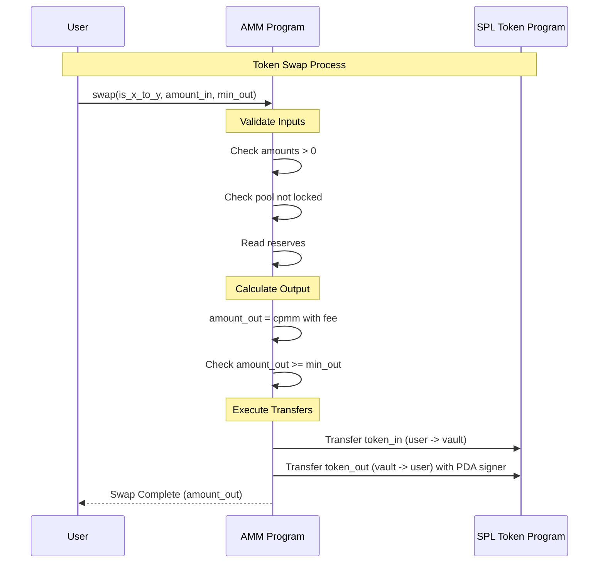

# Phase 4: Token Swapping

## 🎯 What You'll Learn

Dalam tutorial ini, Anda akan belajar:

- Implementasi constant product formula (x × y = k) untuk swap
- Perhitungan jumlah output dengan fee (basis points)
- Slippage protection menggunakan minimum output
- Validasi input, akses, dan keamanan dasar
- Cross-program invocations (CPI) untuk transfer token
- Penulisan test end-to-end untuk operasi swap

---

## Step 1: Swap Instruction Context

### 🔧 Implementasi Swap Context

Mari kita buat instruction context untuk operasi swap.

**Step 1.1: Create Swap Context**

Edit file `programs/amm/src/instructions/swap.rs`:

```rust
use crate::{constants::*, error::AmmError, state::Config};
use anchor_lang::prelude::*;
use anchor_spl::token::{self, Mint, Token, TokenAccount, Transfer};

#[derive(Accounts)]
pub struct Swap<'info> {
    /// User performing the swap
    #[account(mut)]
    pub user: Signer<'info>,

    /// AMM config account
    #[account(
        seeds = [CONFIG_SEED.as_bytes(), config.seed.to_le_bytes().as_ref()],
        bump = config.config_bump,
        constraint = !config.locked @ AmmError::PoolLocked
    )]
    pub config: Account<'info, Config>,

    /// First token mint
    #[account(constraint = mint_x.key() == config.mint_x @ AmmError::InvalidToken)]
    pub mint_x: Account<'info, Mint>,

    /// Second token mint
    #[account(constraint = mint_y.key() == config.mint_y @ AmmError::InvalidToken)]
    pub mint_y: Account<'info, Mint>,

    /// User's token X account
    #[account(
        mut,
        token::mint = mint_x,
        token::authority = user
    )]
    pub user_x: Account<'info, TokenAccount>,

    /// User's token Y account
    #[account(
        mut,
        token::mint = mint_y,
        token::authority = user
    )]
    pub user_y: Account<'info, TokenAccount>,

    /// Vault for token X
    #[account(
        mut,
        seeds = [VAULT_X_SEED.as_bytes(), config.seed.to_le_bytes().as_ref()],
        bump,
        token::mint = mint_x,
        token::authority = config
    )]
    pub vault_x: Account<'info, TokenAccount>,

    /// Vault for token Y
    #[account(
        mut,
        seeds = [VAULT_Y_SEED.as_bytes(), config.seed.to_le_bytes().as_ref()],
        bump,
        token::mint = mint_y,
        token::authority = config
    )]
    pub vault_y: Account<'info, TokenAccount>,

    /// SPL Token program
    pub token_program: Program<'info, Token>,
}

impl<'info> Swap<'info> {
    /// Validate swap parameters
    pub fn validate(&self, amount_in: u64, min_out: u64) -> Result<()> {
        // Check positive amounts
        require!(amount_in > 0 && min_out > 0, AmmError::InvalidAmount);

        // Pool must have liquidity
        require!(self.vault_x.amount > 0 && self.vault_y.amount > 0, AmmError::ZeroBalance);

        Ok(())
    }

    /// Read reserves based on direction
    pub fn get_reserves(&self, is_x_to_y: bool) -> (u64, u64) {
        if is_x_to_y {
            (self.vault_x.amount, self.vault_y.amount)
        } else {
            (self.vault_y.amount, self.vault_x.amount)
        }
    }

    /// Constant product with fee: returns amount_out
    pub fn calculate_amount_out(&self, amount_in: u64, reserve_in: u64, reserve_out: u64) -> Result<u64> {
        // amount_in_with_fee = amount_in * (FEE_BASIS_POINTS - fee)
        let fee_bps = self.config.fee as u128;
        let denom_bps = FEE_BASIS_POINTS as u128;

        let amount_in_u128 = amount_in as u128;
        let reserve_in_u128 = reserve_in as u128;
        let reserve_out_u128 = reserve_out as u128;

        let amount_in_with_fee = amount_in_u128
            .checked_mul(denom_bps.checked_sub(fee_bps).ok_or(AmmError::Underflow)?)
            .ok_or(AmmError::Overflow)?;

        // numerator = amount_in_with_fee * reserve_out
        let numerator = amount_in_with_fee
            .checked_mul(reserve_out_u128)
            .ok_or(AmmError::Overflow)?;

        // denominator = reserve_in * denom_bps + amount_in_with_fee
        let denominator = reserve_in_u128
            .checked_mul(denom_bps)
            .ok_or(AmmError::Overflow)?
            .checked_add(amount_in_with_fee)
            .ok_or(AmmError::Overflow)?;

        let amount_out = numerator
            .checked_div(denominator)
            .ok_or(AmmError::ZeroBalance)? as u64;

        require!(amount_out > 0, AmmError::SlippageExceeded);
        Ok(amount_out)
    }

    /// Transfer tokens from user to vault (token in)
    pub fn transfer_in(&self, is_x_to_y: bool, amount_in: u64) -> Result<()> {
        let (from, to) = if is_x_to_y {
            (self.user_x.to_account_info(), self.vault_x.to_account_info())
        } else {
            (self.user_y.to_account_info(), self.vault_y.to_account_info())
        };

        let cpi_ctx = CpiContext::new(
            self.token_program.to_account_info(),
            Transfer {
                from,
                to,
                authority: self.user.to_account_info(),
            },
        );
        token::transfer(cpi_ctx, amount_in)
    }

    /// Transfer tokens from vault to user (token out)
    pub fn transfer_out(&self, is_x_to_y: bool, amount_out: u64, config_bump: u8) -> Result<()> {
        let seeds = &[
            CONFIG_SEED.as_bytes(),
            &self.config.seed.to_le_bytes(),
            &[config_bump],
        ];
        let signer_seeds = &[&seeds[..]];

        let (from, to) = if is_x_to_y {
            (self.vault_y.to_account_info(), self.user_y.to_account_info())
        } else {
            (self.vault_x.to_account_info(), self.user_x.to_account_info())
        };

        let cpi_ctx = CpiContext::new_with_signer(
            self.token_program.to_account_info(),
            Transfer {
                from,
                to,
                authority: self.config.to_account_info(),
            },
            signer_seeds,
        );
        token::transfer(cpi_ctx, amount_out)
    }
}
```

**Penjelasan Key Components:**

- **Akun dinamis**: Kita sertakan kedua sisi (`user_x`, `user_y`, `vault_x`, `vault_y`) agar instruksi bisa memilih arah swap saat runtime.
- **Validasi**: Cek nilai positif dan ketersediaan likuiditas.
- **Perhitungan**: Menggunakan constant product formula dengan fee berbasis basis points.
- **CPI**: Gunakan `Transfer` untuk memindahkan token dari user ke vault dan dari vault ke user, dengan PDA `config` sebagai signer saat transfer keluar dari vault.

---

## Step 2: Swap Implementation Logic

### 🔧 Implementasi Swap Handler

Tambahkan handler function di `programs/amm/src/instructions/swap.rs`:

```rust
pub fn swap_handler(
    ctx: Context<Swap>,
    is_x_to_y: bool,
    amount_in: u64,
    min_out: u64,
) -> Result<()> {
    // Validate inputs
    ctx.accounts.validate(amount_in, min_out)?;

    let config_bump = ctx.accounts.config.config_bump;

    // Read reserves based on direction
    let (reserve_in, reserve_out) = ctx.accounts.get_reserves(is_x_to_y);

    // Calculate output amount
    let amount_out = ctx
        .accounts
        .calculate_amount_out(amount_in, reserve_in, reserve_out)?;

    // Slippage protection
    require!(amount_out >= min_out, AmmError::SlippageExceeded);

    // Execute transfers
    // 1) User -> Vault (token in)
    ctx.accounts.transfer_in(is_x_to_y, amount_in)?;

    // 2) Vault -> User (token out) using PDA signer
    ctx.accounts.transfer_out(is_x_to_y, amount_out, config_bump)?;

    msg!("Swap executed successfully!");
    msg!("Direction: {}", if is_x_to_y { "X -> Y" } else { "Y -> X" });
    msg!("Amount In: {}", amount_in);
    msg!("Amount Out: {}", amount_out);

    Ok(())
}
```

**Penjelasan Implementation:**

- **Slippage**: `min_out` melindungi user dari output yang lebih kecil dari ekspektasi.
- **Signer Seeds**: Transfer keluar dari vault memerlukan `invoke_signed` dengan seeds PDA `config`.
- **Logging**: Memberikan informasi penting untuk debugging.

---

## Step 3: Integrasi dengan Main Program

### 🔧 Update Main Program File

**Step 3.1: Update `lib.rs`**

Edit file `programs/amm/src/lib.rs`:

```rust
use anchor_lang::prelude::*;

pub mod constants;
pub mod error;
pub mod instructions;
pub mod state;

use instructions::*;

declare_id!("GcVc8WR7EiPBuDiHGWFCRB8Tpjcqr7d4Jur3uLs1Fs1u");

#[program]
pub mod amm {
    use super::*;

    /// Initialize a new AMM pool
    pub fn initialize(ctx: Context<Initialize>, seed: u64, fee: u16) -> Result<()> {
        instructions::initialize::initialize_handler(ctx, seed, fee)
    }

    /// Deposit liquidity to the pool
    pub fn deposit(
        ctx: Context<Deposit>,
        amount_x: u64,
        amount_y: u64,
        min_lp: u64,
    ) -> Result<()> {
        instructions::deposit::deposit_handler(ctx, amount_x, amount_y, min_lp)
    }

    /// Withdraw liquidity from the pool
    pub fn withdraw(
        ctx: Context<Withdraw>,
        lp_amount: u64,
        min_x: u64,
        min_y: u64,
    ) -> Result<()> {
        instructions::deposit::withdraw_handler(ctx, lp_amount, min_x, min_y)
    }

    /// Swap tokens using constant product curve
    pub fn swap(
        ctx: Context<Swap>,
        is_x_to_y: bool,
        amount_in: u64,
        min_out: u64,
    ) -> Result<()> {
        instructions::swap::swap_handler(ctx, is_x_to_y, amount_in, min_out)
    }
}
```

**Step 3.2: Update Instructions Module**

Pastikan `programs/amm/src/instructions/mod.rs` mengekspor `swap`:

```rust
pub mod deposit;
pub mod initialize;
pub mod swap;

pub use deposit::*;
pub use initialize::*;
pub use swap::*;
```

---

## Step 4: Mathematical Formulations

### 🔧 Constant Product dengan Fee

Misalkan:

- x: reserve token in
- y: reserve token out
- f: fee dalam basis points
- B: FEE_BASIS_POINTS (default 10000)
- a_in: jumlah token in

Maka:

- a_in_fee = a_in × (B - f)
- numerator = a_in_fee × y
- denominator = x × B + a_in_fee
- a_out = floor(numerator / denominator)

Catatan:

- f = 30 bps berarti 0.30% fee. Jika f = 300, maka 3% fee.
- Pastikan semua operasi menggunakan checked arithmetic untuk mencegah overflow/underflow.

---

## Step 5: Swap Flow Diagram

### 🔧 Visual Flow Understanding



---

## Step 6: Testing Token Swapping

### 🔧 Create Test File

**Step 6.1: Basic Swap Tests**

Buat file `tests/swap.ts`:

```typescript
import * as anchor from "@coral-xyz/anchor";
import { Program } from "@coral-xyz/anchor";
import { PublicKey, Keypair, SystemProgram } from "@solana/web3.js";
import {
  TOKEN_PROGRAM_ID,
  ASSOCIATED_TOKEN_PROGRAM_ID,
  createMint,
  getOrCreateAssociatedTokenAccount,
  mintTo,
  getAccount,
} from "@solana/spl-token";
import { Amm } from "../target/types/amm";
import { expect } from "chai";

describe("AMM Token Swapping", () => {
  const provider = anchor.AnchorProvider.env();
  anchor.setProvider(provider);
  const program = anchor.workspace.Amm as Program<Amm>;

  let mintX: PublicKey;
  let mintY: PublicKey;
  let authority: Keypair;
  let trader: Keypair;
  let configPda: PublicKey;
  let lpMintPda: PublicKey;
  let vaultXPda: PublicKey;
  let vaultYPda: PublicKey;
  const seed = new anchor.BN(55555);
  const fee = 30; // 0.30%

  beforeEach(async () => {
    authority = Keypair.generate();
    trader = Keypair.generate();

    await Promise.all([
      provider.connection.confirmTransaction(
        await provider.connection.requestAirdrop(authority.publicKey, 2_000_000_000)
      ),
      provider.connection.confirmTransaction(
        await provider.connection.requestAirdrop(trader.publicKey, 2_000_000_000)
      ),
    ]);

    // Create mints
    mintX = await createMint(provider.connection, authority, authority.publicKey, null, 6);
    mintY = await createMint(provider.connection, authority, authority.publicKey, null, 6);

    // PDAs
    [configPda] = PublicKey.findProgramAddressSync(
      [Buffer.from("config"), seed.toArrayLike(Buffer, "le", 8)],
      program.programId
    );
    [lpMintPda] = PublicKey.findProgramAddressSync(
      [Buffer.from("lp_mint"), seed.toArrayLike(Buffer, "le", 8)],
      program.programId
    );
    [vaultXPda] = PublicKey.findProgramAddressSync(
      [Buffer.from("vault_x"), seed.toArrayLike(Buffer, "le", 8)],
      program.programId
    );
    [vaultYPda] = PublicKey.findProgramAddressSync(
      [Buffer.from("vault_y"), seed.toArrayLike(Buffer, "le", 8)],
      program.programId
    );

    // Initialize pool
    await program.methods
      .initialize(seed, fee)
      .accounts({
        authority: authority.publicKey,
        config: configPda,
        mintX: mintX,
        mintY: mintY,
        lpMint: lpMintPda,
        vaultX: vaultXPda,
        vaultY: vaultYPda,
        tokenProgram: TOKEN_PROGRAM_ID,
        associatedTokenProgram: ASSOCIATED_TOKEN_PROGRAM_ID,
        systemProgram: SystemProgram.programId,
      })
      .signers([authority])
      .rpc();

    // Seed initial liquidity by authority
    const authX = await getOrCreateAssociatedTokenAccount(provider.connection, authority, mintX, authority.publicKey);
    const authY = await getOrCreateAssociatedTokenAccount(provider.connection, authority, mintY, authority.publicKey);

    await mintTo(provider.connection, authority, mintX, authX.address, authority, 1_000_000_000);
    await mintTo(provider.connection, authority, mintY, authY.address, authority, 2_000_000_000);

    const userLpAta = await getOrCreateAssociatedTokenAccount(provider.connection, authority, lpMintPda, authority.publicKey);

    await program.methods
      .deposit(new anchor.BN(100_000_000), new anchor.BN(200_000_000), new anchor.BN(1))
      .accounts({
        user: authority.publicKey,
        config: configPda,
        mintX: mintX,
        mintY: mintY,
        lpMint: lpMintPda,
        userX: authX.address,
        userY: authY.address,
        userLp: userLpAta.address,
        vaultX: vaultXPda,
        vaultY: vaultYPda,
        tokenProgram: TOKEN_PROGRAM_ID,
        associatedTokenProgram: ASSOCIATED_TOKEN_PROGRAM_ID,
        systemProgram: SystemProgram.programId,
      })
      .signers([authority])
      .rpc();

    // Fund trader with token X
    const traderX = await getOrCreateAssociatedTokenAccount(provider.connection, trader, mintX, trader.publicKey);
    await mintTo(provider.connection, authority, mintX, traderX.address, authority, 10_000_000);
  });

  it("Swaps X -> Y successfully", async () => {
    const traderX = await getOrCreateAssociatedTokenAccount(provider.connection, trader, mintX, trader.publicKey);
    const traderY = await getOrCreateAssociatedTokenAccount(provider.connection, trader, mintY, trader.publicKey);

    const amountIn = new anchor.BN(1_000_000); // 1 token
    const minOut = new anchor.BN(1); // any positive

    const tx = await program.methods
      .swap(true, amountIn, minOut)
      .accounts({
        user: trader.publicKey,
        config: configPda,
        mintX: mintX,
        mintY: mintY,
        userX: traderX.address,
        userY: traderY.address,
        vaultX: vaultXPda,
        vaultY: vaultYPda,
        tokenProgram: TOKEN_PROGRAM_ID,
      })
      .signers([trader])
      .rpc();

    console.log("Swap X->Y tx:", tx);

    const outAfter = await getAccount(provider.connection, traderY.address);
    expect(Number(outAfter.amount)).to.be.greaterThan(0);
  });

  it("Swaps Y -> X successfully with min_out check", async () => {
    const traderX = await getOrCreateAssociatedTokenAccount(provider.connection, trader, mintX, trader.publicKey);
    const traderY = await getOrCreateAssociatedTokenAccount(provider.connection, trader, mintY, trader.publicKey);

    const amountIn = new anchor.BN(2_000_000); // 2 tokens
    const minOut = new anchor.BN(1); // minimal safeguard

    await program.methods
      .swap(false, amountIn, minOut)
      .accounts({
        user: trader.publicKey,
        config: configPda,
        mintX: mintX,
        mintY: mintY,
        userX: traderX.address,
        userY: traderY.address,
        vaultX: vaultXPda,
        vaultY: vaultYPda,
        tokenProgram: TOKEN_PROGRAM_ID,
      })
      .signers([trader])
      .rpc();

    const outAfter = await getAccount(provider.connection, traderX.address);
    expect(Number(outAfter.amount)).to.be.greaterThan(0);
  });

  it("Fails when slippage exceeded", async () => {
    const traderX = await getOrCreateAssociatedTokenAccount(provider.connection, trader, mintX, trader.publicKey);
    const traderY = await getOrCreateAssociatedTokenAccount(provider.connection, trader, mintY, trader.publicKey);

    const amountIn = new anchor.BN(1_000_000);
    const absurdMinOut = new anchor.BN(10_000_000_000); // intentionally too high

    try {
      await program.methods
        .swap(true, amountIn, absurdMinOut)
        .accounts({
          user: trader.publicKey,
          config: configPda,
          mintX: mintX,
          mintY: mintY,
          userX: traderX.address,
          userY: traderY.address,
          vaultX: vaultXPda,
          vaultY: vaultYPda,
          tokenProgram: TOKEN_PROGRAM_ID,
        })
        .signers([trader])
        .rpc();
      expect.fail("Should have failed with SlippageExceeded");
    } catch (err: any) {
      expect(err.message).to.include("SlippageExceeded");
    }
  });
});
```

---

## Step 7: Security & Best Practices

- **Access Control**: Gunakan `config` sebagai authority untuk vaults; semua transfer keluar harus menggunakan signer seeds.
- **Checked Math**: Seluruh operasi aritmatika menggunakan checked ops untuk mencegah overflow/underflow.
- **Slippage Protection**: Wajibkan `min_out` agar trader aman dari perubahan harga mendadak.
- **Fee Bounds**: Validasi `fee` pada saat initialize (sudah dilakukan di Phase 2) agar tidak melebihi batas wajar.
- **State Checks**: `config.locked` dapat digunakan untuk menghentikan sementara trading pada kondisi darurat.

---

## 🎯 Tutorial Complete!

Anda telah menyelesaikan Phase 4: Token Swapping. Sekarang Anda memiliki:

- Swap instruction lengkap dengan perhitungan constant product + fee
- Slippage protection dan validasi input
- CPI transfer in/out dengan PDA signer
- Test end-to-end untuk arah X->Y dan Y->X

---

## 🚀 Next Steps

**Phase 5**: Testing & Deployment

- Tambahkan unit/integration tests yang lebih komprehensif (fuzzing input, edge cases).
- Jalankan CI untuk build dan test otomatis.
- Deploy ke `devnet` untuk uji coba publik dan monitoring.
- Audit keamanan dasar, termasuk penanganan nilai ekstrem dan interaksi CPI.

**Running Your Swap Tests:**

```bash
# Build the program
anchor build

# Run swap tests (pastikan validator lokal sudah berjalan atau gunakan --skip-local-validator)
anchor test tests/swap.ts --skip-local-validator

# Start local validator untuk eksperimen manual
solana-test-validator
```

---

## 📚 Daftar Pustaka & Referensi

### 🔬 AMM Theory & Mathematics

- Constant Product Market Maker (CPMM): x × y = k
- Fee-adjusted swap formula dan slippage
- Referensi: [Uniswap V2 Whitepaper](https://uniswap.org/whitepaper.pdf)

### 🏗️ Solana & Anchor

- PDA & seeds untuk authority vaults
- CPI dengan `invoke_signed` pada transfer vault → user
- Referensi: [Anchor Book](https://www.anchor-lang.com/docs), [Solana CPI Guide](https://solana.com/id/docs/core/cpi)

### 🏦 SPL Token Program

- Instruksi `transfer`, `mintTo`, `burn`
- ATA untuk akun pengguna
- Referensi: [SPL Token](https://spl.solana.com/token)